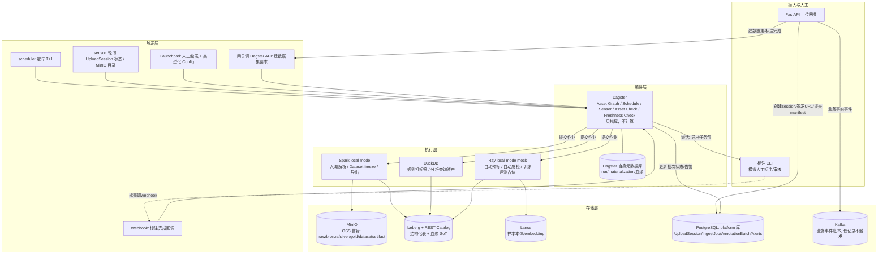
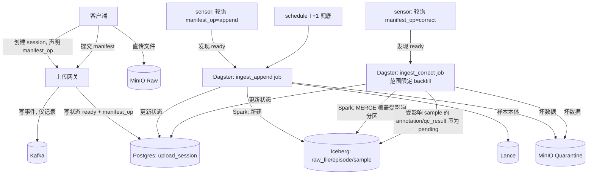
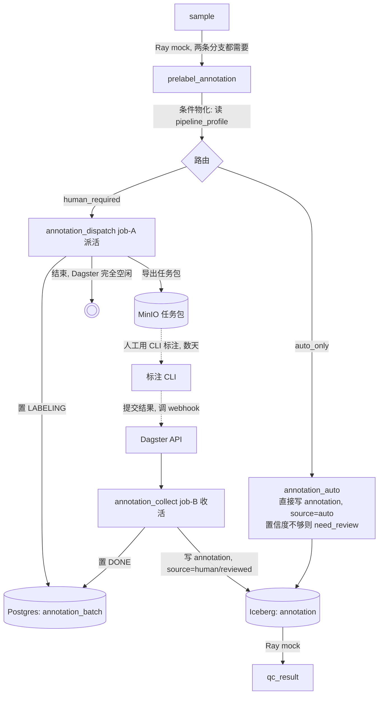
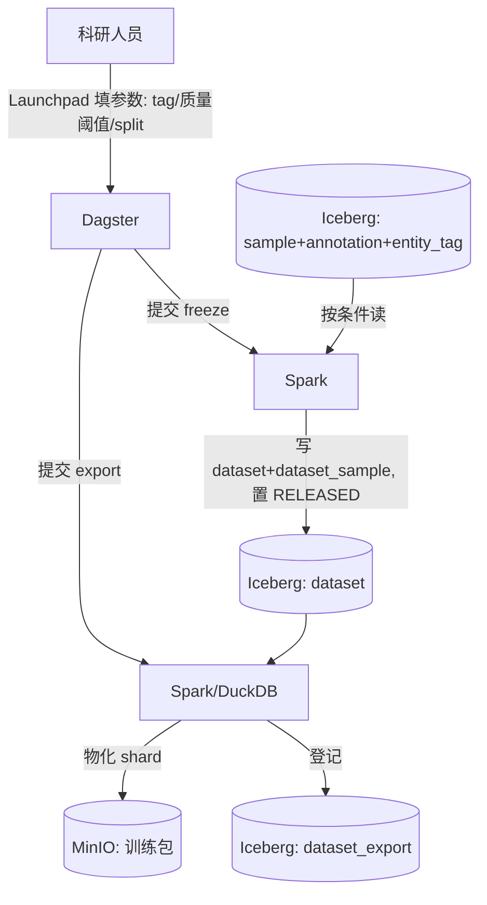
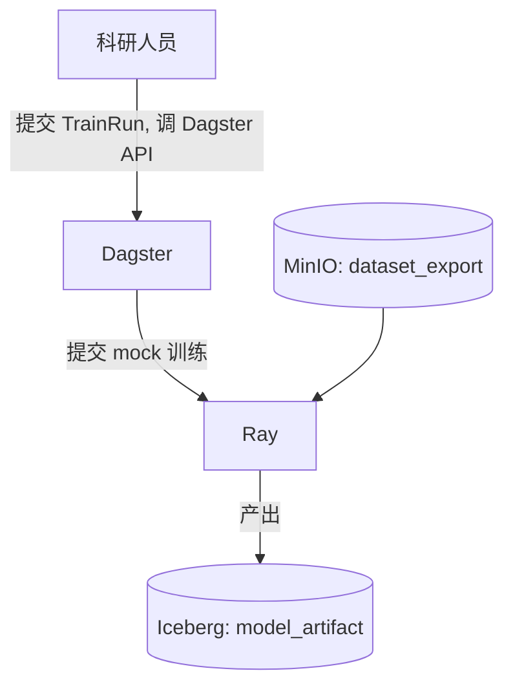
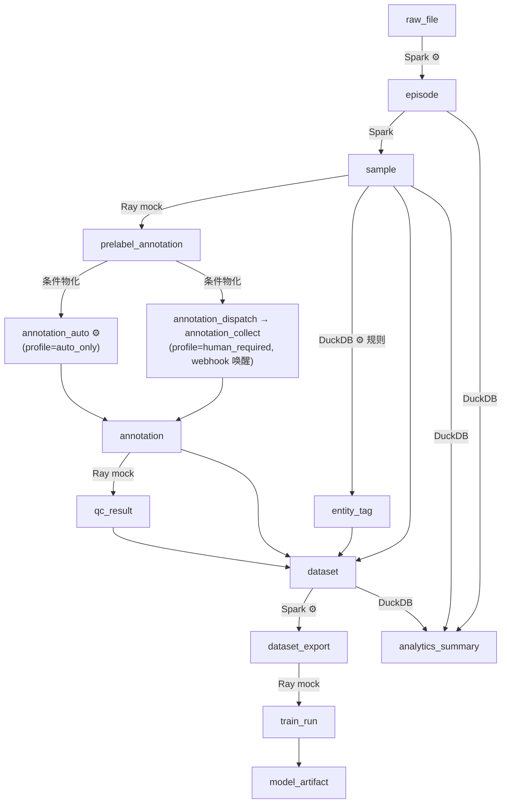

# EDP （数据平台 MVP）

本仓库是我博客《云平台及遥操设计》一文第四节"数据平台"的 MVP 实现。原文设计的是对标 PB 级数据量、多团队协作的完整生产架构；本仓库的目标是**用最小的组件集合**。

不追求处理海量数据，追求的是：**这套架构的骨架、边界、可靠性机制，能不能在小规模上真实跑通。**

---

## 一、功能

EDP MVP 沿着数据平台的主线提供以下能力：

```text
UploadSession -> RawFile -> Episode -> [自动预标] -> Sample -> [人工标注 + 质检] -> Dataset -> [导出训练格式] -> TrainRun -> ModelArtifact
```

**这条主线不是一条写死的流水线。** 同一批数据是否要人工标注、是新增采集还是对历史数据的修正，都会因批次而异（比如：全自动标注一条龙；人工标注一条龙；小规模补数据+修正错误+人工标注）。所以"流程本身可以按批次分支、处理逻辑可以按需替换"是和上面这条主线同等重要的功能，不是事后补丁——具体机制见 2.2 设计原则与 3.2.2 节。

| 能力            | 说明                                                                   | 主要面向角色               |
| ------------- | -------------------------------------------------------------------- | -------------------- |
| 数据上传与入湖       | 客户端创建上传会话、直传原始文件（MCAP 等）、提交 manifest，系统自动解析成结构化的 `episode`/`sample`  | 工程团队 / 采集端           |
| 灵活流程编排        | 按 `manifest.op`（新增/修正）和 `pipeline_profile`（全自动/需人工）两个正交维度组合出不同处理路径，新增一种路径不需要改已有代码 | 工程团队 / 科研人员           |
| 自动预标（mock）    | 对新样本跑一个"假模型"，产出预标注，占位真实 VLM/检测模型的接口位置                                | 工程团队                 |
| 人工标注与质检闭环     | 派活（导出待标任务包）→ 人工标注（MVP 用 CLI 脚本模拟）→ 收活（导入结果 + 自动质检 + 抽检）              | 科研人员 / 标注方           |
| 处理策略可插拔       | 清洗/打标签/质检等步骤的具体算法由策略注册表解析，替换算法只改配置不改编排图                            | 科研人员 / 工程团队          |
| Tag 自由组织      | 声明式/规则/模型/人工四种来源的标签，用于圈数据、建 Dataset                                  | 科研人员                 |
| Dataset 冻结发布  | 按过滤条件 + 质量阈值挑样本，生成不可变、带版本和 hash 的 Dataset                            | 科研人员                 |
| 训练格式导出        | 把 Dataset 清单物化成可被 dataloader 消费的 shard                               | 科研人员                 |
| 训练/评测消费（mock） | 一个占位作业读取导出包，产出 `model_artifact`，验证消费侧接口                              | 科研人员                 |
| 端到端血缘反查       | 给一个 `dataset_version`，能一路 SQL join 回具体原始文件                           | 全员                   |
| 自助数据探索        | 通过 Dagster 的 Asset Catalog 浏览"有什么数据、怎么来的"，通过 DuckDB 直接查 Iceberg 表做分析 | 科研人员（自服务，减少对工程团队的依赖） |
| 运行状态可观测       | 在 Dagster UI 上看到每次运行的成功/失败/重试、数据新鲜度、质量门是否通过，且能直接分辨一次运行走的是哪条处理路径        | 全员                   |


---

## 二、架构设计

### 2.1 设计描述

数据平台要回答的核心问题是：一次采集的数据从落地到能被训练消费，中间要经过清洗、标注、质检、组织、发布、导出这么多环节，这些环节该由谁处理（执行引擎）、什么时候处理（触发时机）、甚至要不要有人参与，都会因为批次的性质不同而不同——有的批次自动标注就够，有的必须人工介入，有的只是对历史数据的小规模修正，根本不需要走完整链路。如果用一条写死的流水线去应对所有情况，要么把不需要的环节也白跑一遍浪费资源，要么每出现一种新场景就要工程团队改代码、加一条新流水线，长期看两条路都走不通。

同时，这些环节本身的作业形态也天差地别：大批量结构化 ETL、秒级的小批量修正、GPU/模型类作业、以及"要等人干几天"的标注任务。把这些全塞给一个调度器直接执行，或者用一个只会提交批作业的编排器去管理全部形态，也会很快出问题。

这里的设计核心因此有两层：**编排结构要稳定、批次行为要靠配置分支、处理逻辑要靠策略注册表替换**——图的形状不因为业务场景变多而不断膨胀，变的只是数据（配置）；**执行引擎要按活路由**——结构化大批量、秒起秒停的小批量、GPU/模型类作业分别交给最合适的引擎，编排器本身永远只做控制面。在这套结构之上，Iceberg 承担了贯穿全流程的"数据到底存在不存在、是什么状态"这一唯一真相源的角色；Dagster 只负责按配置决定的路径，把控制权从一个阶段交给下一个阶段，本身不参与计算，也不对数据的存在与否下判断。

落到实现上，整个架构立一个**四层心智模型**，所有组件都能归位到这四层里：


| 层       | 回答什么           | 本仓库的实现                                                                           |
| ------- | -------------- | -------------------------------------------------------------------------------- |
| **触发层** | 什么时候开始干        | Dagster 的 schedule / sensor / Launchpad / API                                    |
| **编排层** | 按什么顺序、依赖、重试串起来 | **Dagster**（只指挥，不计算）                                                             |
| **执行层** | 真正算            | **Spark local**（大批量结构化）/ **DuckDB**（小批量+分析查询）/ **Ray mock**（GPU/ML 形态占位）         |
| **存储层** | 数据落在哪          | MinIO（对象存储）/ Iceberg（结构化表+血缘）/ Lance（多模态样本本体）/ PostgreSQL（业务瞬态状态）/ Kafka（业务事件账本） |


一句话：**触发层叫醒编排层，编排层决定这一步该派给哪个执行引擎、干完再叫谁，执行引擎把结果写进存储层。** Kafka 不在触发层里——它只是"发生过什么"的账本，触发永远走 Dagster 自己的机制。

### 2.2 设计原则

1. **编排器只做控制面，不跑计算**：Dagster 的 asset 函数体里只做参数准备和结果校验，真正的计算全部委托给 Spark/DuckDB/Ray 子进程或作业，编排器进程本身可以随时重启不丢数据。
2. **按活路由执行引擎，不是什么都上 Spark**：结构化大批量→Spark；秒起秒停的小批量/分析查询→DuckDB；GPU/模型形态→Ray。任务只声明"要什么资源"，路由规则决定派给谁。
3. **Iceberg commit 是数据唯一真相源**：一份数据算不算存在，以它有没有被 Iceberg 快照引用为准；其余存储（Tablestore/Kafka/Dagster 元数据）都是可重建的派生投影。
4. **Dataset 是不可变发布物**：训练/评测引用固定的 `dataset_name + dataset_version`，不是"某个目录下当前所有文件"。
5. **触发方式多样，但全部收敛进编排器**：定时、外部事件感知、人工点按钮、API 调用、Webhook 回调，都是 Dagster 原生支持的触发方式，不需要额外的消息总线做"门铃"。
6. **每个域独立 SoT，禁止跨域越权判断**：数据事实只问 Iceberg，编排过程事实只问 Dagster 自己的元数据库，两者通过 `asset_key ↔ 表名` 和 `snapshot_id` 互相引用，但谁都不替对方做主。
7. **自助优先**：科研人员通过 Dagster UI 的 Asset Catalog、带类型校验的 Launchpad、Partition Backfill 自己浏览数据、发起建数据集请求、重跑历史分区，不需要每次找工程团队写脚本。
8. **幂等写入，安全重试**：所有作业按批次/分区做 `MERGE`/`overwrite`，保证"至少一次 + 幂等 = 最终一致"，回填和重试永远安全。
9. **结构性分支用独立 asset 表达，行为性替换用注册表表达**：走的步骤本身不同（比如要不要人工标注）必须拆成独立命名的 Dagster asset，用条件物化让 UI 能直接看出这次走了哪条路；只是换个算法/脚本、步骤形状不变的，通过策略注册表在运行时解析，不新增 asset，只把用了哪个策略写进物化 metadata。两者不能混在一个函数的 if/else 里，否则编排图就失去了"一眼看出走了哪条路"的能力。
10. **分区键对齐批次到达方式，合并永远是局部的**：`episode`/`sample` 这类需要 `MERGE` 的索引表按 `date + robot_id` 分区，保证一批新数据的合并只触达它自己的分区/文件，不随历史数据总量增长而变慢；真正海量的 Bronze/Silver 信号表是纯追加、不参与合并。定期 compaction 维持文件大小，保证分区裁剪长期有效。

### 2.3 架构图




### 2.4 组件清单


| 分类            | 组件                       | MVP 实现                                             | 职责                                                                |
| ------------- | ------------------------ | -------------------------------------------------- | ----------------------------------------------------------------- |
| 编排            | Dagster                  | `dagster` + `dagster-webserver` + `dagster-daemon` | 统一调度三类执行引擎；schedule/sensor/API 触发；asset 版本、血缘、质量门、新鲜度、重试、回填、UI    |
| 批处理执行         | Spark                    | Spark local mode + Iceberg runtime                 | 分层解析、清洗、Dataset freeze、指标聚合、写 Iceberg                             |
| 小批量/分析执行      | DuckDB                   | Python `duckdb` + Iceberg extension                | 规则打标签（小批量增量）、直接查 Iceberg 做分析类资产                                   |
| GPU/ML 执行（占位） | Ray                      | Ray local mode，`@ray.remote`                       | 自动预标、自动质检、训练/评测的接口占位，逻辑先用规则/随机数 mock                              |
| 对象存储          | MinIO                    | 单节点                                                | Raw/Bronze/Silver/Gold/Dataset/Artifact 分区                        |
| 表格式与目录        | Iceberg + REST Catalog   | Lakekeeper（或 Apache Polaris，二选一）                   | 结构化表管理，ACID、快照、时间旅行，血缘 SoT                                        |
| 多模态存储         | Lance                    | 本地/MinIO 后端                                        | 样本本体、预标 embedding，被 Iceberg 表指针引用                                 |
| 业务状态存储        | PostgreSQL（`platform` 库） | 独立 schema，与 Dagster 自身元数据库（`dagster` 库）分开          | UploadSession、IngestJob、AnnotationBatch、Alerts、DatasetRequest     |
| 业务事件账本        | Kafka                    | 单节点 KRaft                                          | upload/manifest/episode/dataset 等事实事件，可重放，**不做触发源**               |
| 接入网关          | FastAPI                  | 常驻服务                                               | 鉴权占位、创建会话、签发 MinIO 预签名 URL、接收 manifest、转发建数据集/标注完成请求给 Dagster API |
| 人工标注          | CLI 脚本                   | Python 命令行工具                                       | 模拟"导出待标任务包 → 人工编辑 → 提交结果并调 webhook"，接口边界对齐未来接 Label Studio/CVAT   |
| 策略注册表         | `pipeline_step_config` 表（Postgres `platform` 库） | 1 个默认策略 + 1 个备用策略 | 每个处理阶段（清洗/打标签/质检/导出）按 `strategy_id` 解析出具体执行的函数/脚本，新增策略只加配置不改编排图 |
| 合成数据          | 数据生成器 / 真实样本             | Python 脚本 + `mcap` 库；也支持直接放入真实 MCAP 样本文件           | 生成或提供带 imu/pose topic 的 MCAP 文件和 manifest，供 demo 使用                  |


---

## 三、详细设计

### 3.1 关键数据结构

#### 3.1.1 分层数据表（Medallion，MVP 简化版）

MVP 只实现一条 topic 的 Bronze/Silver 作为示例，验证分层机制，不追求覆盖所有传感器：


| 层      | 表                   | 关键字段                                                     | 可变性     |
| ------ | ------------------- | -------------------------------------------------------- | ------- |
| Raw    | 原始文件，MinIO 中原样存放    | —                                                        | 只追加，不可变 |
| Bronze | `bronze_<topic>`    | `robot_id, episode_id, source_file, ts, seq, payload...` | 可重建     |
| Silver | `silver_<topic>`    | `episode_id, ts, 对齐清洗后字段..., quality_flag`               | 可重建     |
| Gold   | `gold_sample_index` | `episode_id, sample_id, 特征/统计列...`                       | 可重建     |


#### 3.1.2 索引/目录表

`raw_file`（原始文件登记）：


| 字段                     | 类型        | 含义                   |
| ---------------------- | --------- | -------------------- |
| `file_uri`             | STRING    | 对象存储路径，主键            |
| `robot_id` / `task_id` | STRING    | 采集上下文                |
| `start_ts` / `end_ts`  | TIMESTAMP | 文件覆盖的时间区间            |
| `sha256`               | STRING    | 内容指纹                 |
| `schema_version`       | STRING    | 数据格式版本               |
| `upload_id`            | STRING    | 所属上传事务               |
| `status`               | STRING    | `ok` / `quarantined` |


`episode`（一次连续采集的语义单元）：


| 字段                                         | 类型        | 含义                             |
| ------------------------------------------ | --------- | ------------------------------ |
| `episode_id`                               | STRING    | 主键                             |
| `robot_id` / `task_id` / `operator`        | STRING    | 采集上下文                          |
| `start_ts` / `end_ts`                      | TIMESTAMP | 时间区间                           |
| `firmware_ver` / `calib_ver` / `agent_ver` | STRING    | 复现所需的版本信息                      |
| `source`                                   | STRING    | `declared` / `auto` / `manual` |


`episode_file`（`episode` × `raw_file` 多对多关联表）：`episode_id, file_uri, ordinal`。

`sample`（切出的训练/评测样本，本体在 Lance）：


| 字段               | 类型                 | 含义     |
| ---------------- | ------------------ | ------ |
| `sample_id`      | STRING             | 主键     |
| `episode_id`     | STRING             | 外键     |
| `slicer_version` | STRING             | 切片方案版本 |
| `lance_uri`      | STRING             | 样本本体位置 |
| `quality_score`  | DOUBLE             | 综合质量分  |
| `quality_tags`   | MAP<STRING,DOUBLE> | 分维度质量分 |


#### 3.1.3 标注与质检表

`annotation_task`（一个标注批次）：`task_id, prelabel_run_id, package_uri, status(PRELABELING→PACKAGED→LABELING→RETURNED→QC→DONE)`。

`annotation`（标注结果，可版本化）：


| 字段                          | 类型     | 含义                                         |
| --------------------------- | ------ | ------------------------------------------ |
| `anno_id`                   | STRING | 主键                                         |
| `target_type` / `target_id` | STRING | 打在谁身上：episode / sample                     |
| `type`                      | STRING | `lang` / `segment` / `success` / `quality` |
| `value_or_uri`              | STRING | 标注内容                                       |
| `source`                    | STRING | `auto` / `human` / `reviewed`              |
| `anno_version`              | STRING | 标注方案版本                                     |
| `review_status`             | STRING | `pending` / `passed` / `rejected`          |


`qc_result`（质检结论）：`target_id, check_type(data/annotation), verdict(pass/fail/need_review), score, by(auto/人)`。

#### 3.1.4 Tag 表

`entity_tag`：`target_type, target_id, tag_key, tag_value, source(declared/rule/model/human), tagged_by, tagged_at`。

`tag_def`（词表治理）：`tag_key, allowed_values, owner, description`。

#### 3.1.5 业务层表（Dataset）


| 表                        | 关键字段                                                                                                       | 说明              |
| ------------------------ | ---------------------------------------------------------------------------------------------------------- | --------------- |
| `dataset`                | `dataset_name, dataset_version, manifest_hash, filter_expr, code_ver, state(BUILDING/RELEASED/DEPRECATED)` | 冻结的、不可变的样本集合    |
| `dataset_sample`         | `dataset_name, dataset_version, sample_id`                                                                 | 引用清单，既是清单也是权威血缘 |
| `dataset_export`         | `dataset_version, format, shard_uri, num_shards, hash`                                                     | 物化出的训练格式包       |
| `train_run` / `eval_run` | `run_id, dataset_version, code_ver, params, metrics, state`                                                | mock 训练/评测任务    |
| `model_artifact`         | `model_id, run_id, dataset_version, format`                                                                | 产物元数据           |


#### 3.1.6 业务状态表（PostgreSQL `platform` 库）

`upload_session`、`ingest_job`、`annotation_batch`、`dataset_request`、`alerts`——只存"当前状态点查"，理论上可从 Iceberg + Kafka 重建，不是数据 SoT。

`upload_session` 额外携带两个**正交的流程配置字段**，用来决定这批数据走哪条处理路径（详见 3.2.1/3.2.2）：

| 字段 | 取值 | 决定什么 |
| --- | --- | --- |
| `manifest_op` | `append`（新增采集）/ `correct`（修正已有分区） | 入湖清洗阶段：新建 episode，还是对已有分区做范围限定的 backfill 式覆盖重写 |
| `pipeline_profile` | `auto_only`（全自动）/ `human_required`（需人工） | 标注阶段：预标结果直接晋升为正式标注，还是要走派活/收活两段式人工流程 |

#### 3.1.7 流程配置表（策略注册表）

`pipeline_step_config`——每个处理阶段实际执行哪个策略，由这张表在运行时解析，新增策略只加一行配置，不改 Dagster 资产图：

| 字段 | 类型 | 含义 |
| --- | --- | --- |
| `stage` | STRING | 处理阶段，如 `silver_clean` / `entity_tag` / `qc` / `export` |
| `strategy_id` | STRING | 策略标识，资产运行时按 `(stage, strategy_id)` 查这张表 |
| `entrypoint` | STRING | 具体执行的函数/脚本引用 |
| `owner` | STRING | 谁负责这个策略（自文档化，减少答疑） |
| `is_default` | BOOLEAN | 该 stage 下未指定 `strategy_id` 时使用的默认策略 |

MVP 只登记 **1 个默认策略 + 1 个备用策略**证明机制可行；每次物化把实际解析到的 `strategy_id` 写进 Dagster 物化 metadata，做到"不新增节点也能在 UI 上看出用了哪个策略"。

#### 3.1.8 审计列约定

**每一张 Iceberg 表都加四列**，这是全平台可追踪性的地基：

```text
_batch_id STRING      -- 业务批次号，如 20260703-robotA-upload123
_run_id STRING        -- 产生这行数据的 Dagster run id
_ingested_at TIMESTAMP
_source_uri STRING    -- 溯源到具体源文件/上游资产
```

### 3.2 关键流程

#### 3.2.1 上传入湖（按 `manifest_op` 分两条 sensor）

`manifest_op=append`（新增采集）和 `manifest_op=correct`（修正已有分区）从触发的那一刻起就是**两个不同的 sensor 拉起两个不同的 job**，不是同一条链内部分支——这是所有分支形式里最彻底的一种，运行历史上直接看 job 名字就能分辨：



`ingest_append` 只新建/追加，`ingest_correct` 只对受影响的分区做范围限定的 `MERGE`，并把受影响 `sample` 已有的 `annotation`/`qc_result` 标记为 `pending`——重新进入下面 3.2.2 节的标注流程，但走哪条分支仍由该批次的 `pipeline_profile` 决定，不是 `correct` 自带的属性。数据加工到 `sample` 为止。

#### 3.2.2 预标 + 标注 + 质检（按 `pipeline_profile` 条件物化分支，人在环）

这是编排最容易出问题的一段，两条原则叠加：**Dagster 不挂着干等，把"要等人"的部分切成"派活"和"收活"两个短 job**；**分支必须是图上独立的 asset，用条件物化表达，UI 才能看出这次走了哪条路**——不能写在一个函数的 if/else 里。



`annotation_auto` 和 `annotation_dispatch/annotation_collect` 是**两个独立命名的 Dagster asset**，只有其中一条会实际物化，另一条在 UI 上显示为 skipped——打开某个批次的运行记录就能一眼看出它走的是哪条路，但两条分支最终都写向同一张 Iceberg `annotation` 表（用 `source` 列区分 auto/human），数据模型不分裂。`annotation_dispatch` 结束后 Dagster 进程层面完全空闲；`annotation_collect` 由 CLI 提交时的 webhook 唤醒，或由一个兜底 sensor 轮询 `annotation_batch.status = RETURNED` 触发。

#### 3.2.3 冻结 Dataset + 导出




冻结前必须过 Asset Check（`sample` 非空、`quality_score` 均值达标、`annotation` 已 `RELEASED`），不过就挡住 `dataset` 资产的物化。

#### 3.2.4 训练/评测（mock）




不跑真训练，脚本读导出包、跑几秒、写产物，验证消费侧接口契约。

#### 3.2.5 综合资产依赖图（跨引擎，Dagster UI 上的实际形态）

这张图是 MVP 最想展示的东西——一张跨三种执行引擎、带条件分支、跨越"等人几天"的真实血缘图。图中带 `⚙` 的节点表示它的具体行为由 3.1.7 节的策略注册表解析，换算法只改配置、不改这张图的形状；虚线框的两个 `annotation_*` 节点是同一次运行里只会亮其中一个的条件物化分支：




---

## 四、技术细节

### 4.1 触发机制映射


| 触发需求       | Dagster 机制                                          | 用在哪             |
| ---------- | --------------------------------------------------- | --------------- |
| 定时 T+1 兜底  | `ScheduleDefinition`                                | 上传入湖            |
| 近实时事件感知    | `sensor` 轮询 `upload_session`/`annotation_batch` 状态表 | 入湖、标注收活兜底       |
| 人工手动触发/回填  | Launchpad + 类型化 Config Schema                       | 运维重跑、科研人员自助建数据集 |
| API 触发     | 网关调 Dagster GraphQL/REST API                        | 建数据集请求          |
| Webhook 触发 | 外部（标注 CLI）回调一个轻量端点                                  | 标注完成唤醒 job-B    |


### 4.2 执行引擎路由


| 活                                  | 特征                           | 引擎                           |
| ---------------------------------- | ---------------------------- | ---------------------------- |
| Bronze/Silver 解析、Dataset freeze、导出 | 结构化、SQL 味、批量                 | Spark local mode             |
| 规则打标签、分析类查询资产                      | 小批量（本地几 GB 内）、秒起秒停           | DuckDB（直接 `iceberg_scan`）    |
| 自动预标、自动质检、mock 训练/评测               | Python + 模型形态（MVP 用规则/随机数占位） | Ray local mode，`@ray.remote` |


任务只声明输入/输出/资源需求，路由规则决定派给谁——这是为将来把 Ray 换成真实 GPU 集群、DuckDB 换成更大规模引擎预留的解耦点。

### 4.3 结构性分支与行为性替换：两种"变化"两种处理方式

这是回应"业务场景灵活多变、处理策略要能灵活拓展"这个需求的具体落地机制，两种变化性质不同，绝不能用同一种手段处理：

| 变化类型 | 例子 | 处理方式 | 为什么 |
| --- | --- | --- | --- |
| **结构性分支**：走的步骤本身不一样 | `pipeline_profile=auto_only` 不用人工，`human_required` 要派活收活；`manifest_op=append/correct` 走不同 job | 拆成**独立命名的 Dagster asset/job**，用条件物化或不同 sensor 表达 | 分支逻辑如果写在一个函数的 if/else 里，Dagster UI 只会显示"这个 asset 成功了"，看不出走的是哪条路；分支必须是图上的节点，才能在 UI 上"方便区分" |
| **行为性替换**：步骤还是那个步骤，换个算法/脚本 | 清洗逻辑从默认换成某科研团队自己的版本 | asset 结构不变，内部按 `strategy_id` 查 3.1.7 节的策略注册表解析出具体函数，把 `strategy_id` 写进物化 metadata | 图的形状不该因为换一个算法就变化；新增策略只加配置，不改编排图，UI 上通过 metadata 仍能看出用了哪个策略 |

一句话判据：**如果这个变化会让下游收到的"事件"种类变多（比如多一种要人工介入的情况），它是结构性的，要拆 asset；如果只是同一件事换个做法，它是行为性的，进注册表。**

### 4.4 Dagster 能力清单与用途


| 能力                            | 用途                                                 | 对应角色收益            |
| ----------------------------- | -------------------------------------------------- | ----------------- |
| Asset Catalog + 全局血缘图         | 所有 Iceberg 表可搜索、可点击查看依赖                            | 科研人员自助发现数据        |
| Asset 描述/Owner/Tag 元数据        | 自文档化，减少重复答疑                                        | 工程团队减负            |
| 富元数据预览（Markdown/表格/图表）        | `dataset` freeze、`analytics_summary` 附带质量分布图       | 科研人员无需下载数据即可判断可用性 |
| Launchpad + 类型化 Config Schema | 建数据集/发起训练时填参数表单而非裸 YAML                            | 科研人员自助操作          |
| Partition + Backfill          | 入湖 asset 按日期分区，UI 选范围一键重跑                          | 科研人员自助重跑历史批次      |
| Asset Checks                  | Dataset freeze 前校验样本数/质量分/标注状态                     | 数据质量有权威结论，不靠口头判断  |
| Freshness Checks              | "T+1 数据早上 9 点还没到"UI 直接标红                           | 无需人肉盯守            |
| Declarative Automation        | `entity_tag`/`analytics_summary` 随上游自动刷新，无需手写 cron | 小工程团队省运维          |
| 失败重试 + 断点重跑                   | `RetryPolicy`；从失败步骤之后重跑，不必从头                       | 省时间省算力            |


### 4.5 数据一致性原则

一次处理要同时写 MinIO 数据文件、Lance 样本文件、Iceberg 元数据、Postgres 状态、Kafka 事件，这是典型多写一致性问题。原则：**不追求跨存储分布式事务，指定唯一真相源，其余向它对齐。**

- 真相源是 **Iceberg commit**：MinIO/Lance 里有没有文件不算数，被 Iceberg 快照引用才算存在。
- **写入顺序固定**：先写数据文件（内容 hash/uuid 命名，保证幂等不覆盖），全部写完最后做一次 Iceberg 原子 commit。commit 失败，前面写的文件就是孤儿，等 GC。
- **孤儿文件靠 GC 兜底**：定期跑 `expire_snapshots`/`remove_orphan_files`。
- **作业幂等**：按 `upload_id`/分区 `MERGE`/`overwrite`，重跑不产生重复。
- **Postgres/Kafka 是派生态**：丢了可以从 Iceberg 快照 + Kafka 事件重放重建，短暂不一致允许存在。

### 4.6 大规模下的合并与转换：为什么不会退化成全表扫描

数据涨到 PB 级后，如果没有明确设计，`MERGE INTO episode` 这类操作确实会越来越慢。能避免这个问题，靠的是三层剪枝叠加，而不是 Iceberg 自动变魔法：

- **分区裁剪**：`episode`/`sample`/`entity_tag` 这类需要 `MERGE` 的索引表按 `date + robot_id` 分区（对齐 2.2 原则 10）。一批新数据的时间和机器人是确定的，`MERGE` 时只会碰这一个分区，不会扫其他历史分区。
- **文件级 min/max 裁剪**：同一分区内，Iceberg 按主键记录每个文件的 min/max 统计，不在这批数据 key 范围内的文件直接跳过。
- **行级重写，不是整表重写**：`MERGE` 命中的行，Iceberg 只重写/标记删除具体涉及的文件，不会把整张表搬一遍。

更关键的一点是：**真正需要 `MERGE` 的索引/目录表本来就"薄"**——一行 `episode` 代表的是一整段采集（可能几十 GB 原始数据），不是一条传感器消息，所以哪怕原始数据到 PB 级，这些表也就是百万行量级。而真正海量的 Bronze/Silver 信号表是**纯追加**，新文件解析出来的行直接按分区加进去，根本不参与 `MERGE`，"合并一张巨表"这件事本来就不会发生在最大的表上。

Dataset freeze 这类"大规模转换"也不是 `MERGE`，是一次带过滤条件的 SELECT（tag、时间范围、质量阈值），只要请求带了裁剪条件，扫描量就是 GB~TB 级，跟湖里总共有多少 PB 无关。

这套机制要长期有效，需要一项持续的运维工作：**定期 compaction**（跑 Iceberg 的 `rewrite_data_files`，把小文件合并到 128–512MB 目标大小）。频繁的小批次 `MERGE` 会产生大量小文件，小文件多了会拖垮分区裁剪的效果——这个作业本身也可以做成一个 Dagster schedule，纳入同一套编排。

### 4.7 SoT 域划分


| 域      | 唯一 SoT                                         | 派生投影                      |
| ------ | ---------------------------------------------- | ------------------------- |
| 数据本体   | **Iceberg**                                    | Dagster UI 展示、DuckDB 查询结果 |
| 表目录与权限 | Iceberg REST Catalog                           | 各引擎视图                     |
| 编排运行态  | **Dagster 自身元数据库**（独立 `dagster` schema）        | UI、告警                     |
| 业务批次状态 | Postgres `platform` 库（半派生，可从 Iceberg+Kafka 重建） | —                         |
| 业务事件账本 | Kafka                                          | —                         |
| 变更意图   | git migration 脚本                               | —                         |


**连接件**：`asset_key` 与 Iceberg 表名一一对应；每次物化把 Iceberg `snapshot_id` 写进 Dagster 物化 metadata，双向可查证。**硬规则**：永远不用 Dagster 的记录回答"数据存不存在"这类问题，只查 Iceberg。

### 4.8 可靠性设计


| 层级      | 机制                                                       |
| ------- | -------------------------------------------------------- |
| 记录级     | 坏记录进 Quarantine（`error_type/source_uri/batch_id`），好记录继续走 |
| 任务级     | `RetryPolicy` 指数退避；终失败写 `alerts` 表（模拟告警通道）               |
| 批次级     | Asset Check 做行数/质量分对账，状态机不允许卡在中间态                        |
| "该跑没跑"  | Freshness Check（deadman）                                 |
| "跑了但不对" | Asset Check 作为管道内质量门，不过阈值挡住下游                            |


### 4.9 MVP 范围边界


| 环节/能力                     | 状态            | 说明                                |
| ------------------------- | ------------- | --------------------------------- |
| 上传入湖、Episode/Sample 生成    | ✅ 进           | 主线基石                              |
| 灵活流程编排（`manifest_op` + `pipeline_profile`） | ✅ 进 | 覆盖"全自动/需人工/修正数据"三类场景组合，见 3.2.1/3.2.2 |
| 策略注册表（1 默认 + 1 备用）        | ✅ 进（最小实现）    | 证明"换算法不改编排图"这个机制可行，不追求策略数量        |
| 标注质检两段式编排                 | ✅ 进（CLI 模拟人工） | 验证风险最高的编排模式                       |
| Tag 系统                    | ✅ 进           | Dataset 过滤主要维度                    |
| Dataset freeze + 导出（单一格式） | ✅ 进           | 只做一种训练格式，验证概念                     |
| Dagster 九项招牌能力            | ✅ 进           | 见 4.4                             |
| 追踪五元组（审计列）                | ✅ 进           | 成本低、价值高                           |
| 分区策略 + 定期 compaction      | ✅ 进（最小实现）    | 见 4.6，保证 MVP 设计在数据变大后依然成立         |
| 真实预标/质检模型（GPU）            | ❌ 不进，mock 占位  | 与验证编排链路目标无关                       |
| K8s + Volcano GPU 调度      | ❌ 不进          | 无真实 GPU 负载，本地跑 Spark/Ray local 即可 |
| Label Studio/CVAT 真实标注工具  | ❌ 不进，CLI 代替   | 生产化时替换，接口边界已预留（见下方 backlog）       |
| RBAC / 安全权限治理             | ❌ 不进          | Dagster OSS 本身也缺，内网访问兜底           |
| Trino/BI 看板               | ❌ 不进          | 用 DuckDB 直查验证即可                   |
| 热配置中心（除策略注册表外的部分）/多格式导出   | ❌ 不进          | 后续按需补                             |


**生产化 backlog（先记录，不在 MVP 实现）**：标注 CLI 的"派活"步骤将来要换成真实查询 Iceberg（`sample`/`prelabel_annotation`）并把数据推送给 Label Studio/CVAT 或外包系统，"收活"步骤换成它们的回调 webhook；CLI 与 Dagster 之间的接口（任务包格式、webhook payload）现在就按这个目标设计，替换时只换标注工具这一端。

---

## 五、部署和运行

### 5.1 环境要求

- Docker + Docker Compose（只跑基础设施：MinIO / Postgres / Kafka / Iceberg REST Catalog）
- Python 3.10+ 与 [uv](https://docs.astral.sh/uv/)（网关 / Dagster / 各 engine 都跑在宿主机，`uv sync` 一次装齐）
- Java 17（PySpark 本地模式需要；`uv sync` 不会装 JVM，需要系统自带或另外装）
- 建议内存 ≥ 16GB（Spark local + Dagster + Ray + Kafka + MinIO 同时起）
- 首次跑 Spark 作业会从 Maven Central 下载 `iceberg-spark-runtime`/`iceberg-aws-bundle` 两个 jar（几十 MB，仅第一次，之后有本地 ivy 缓存）。如果宿主机在防火墙/代理后面，`spark.jars.packages` 走的是 JVM 自己的网络栈，不认 `http_proxy` 这类环境变量，需要显式传 JVM 系统属性，例如：

  ```bash
  export JAVA_TOOL_OPTIONS="-Dhttp.proxyHost=127.0.0.1 -Dhttp.proxyPort=7897 -Dhttps.proxyHost=127.0.0.1 -Dhttps.proxyPort=7897"
  ```

### 5.2 目录结构

```text
edp/
├── docker-compose.yml        # minio, postgres(dagster+platform两库), kafka, iceberg-rest-catalog
├── gateway/                  # FastAPI 上传网关
├── orchestration/            # Dagster 项目：assets/jobs/schedules/sensors/checks/resources
├── engines/
│   ├── spark/                 # 入湖/freeze/导出 PySpark 脚本
│   ├── duckdb/                 # 打标签/分析查询脚本
│   └── ray/                    # mock 预标/质检/训练脚本
├── tools/
│   ├── annotation_cli/        # 标注 CLI（模拟人在环）
│   └── datagen/                # 合成 MCAP + manifest 生成器
├── schemas/                   # Iceberg 表 DDL / 建表脚本
├── docs/                      # 设计文档、图
└── README.md
```

### 5.3 快速开始（已跑通）

```bash
# 0. 装依赖（首次）
cp .env.example .env
uv sync

# 1. 启动基础设施：MinIO / Postgres(dagster+platform两库) / Kafka / Iceberg REST Catalog
#    docker compose 只管这四个纯中间件；网关和 Dagster 是 Python 进程，跑在宿主机，见下面第 2/3 步
docker compose up -d

# 2. 建 Iceberg 表（幂等，重复跑不会报错）；起网关
set -a && source .env && set +a
uv run python -m schemas.iceberg_tables
uv run uvicorn gateway.main:app --host 0.0.0.0 --port ${GATEWAY_PORT:-8000} &

# 3. 起 Dagster（webserver + daemon，daemon 负责跑 sensor/schedule）
export DAGSTER_HOME=/tmp/dagster_home && mkdir -p $DAGSTER_HOME
uv run dagster dev -m orchestration.definitions -p 3000 &

# 4. 生成合成采集数据，或直接把真实 MCAP 样本放进 tools/datagen/fixtures/
uv run python -m tools.datagen.generate --robot r-001 --episodes 3

# 5. 通过网关上传（创建 session -> 直传 -> 提交 manifest）
# --manifest-op append|correct，--pipeline-profile auto_only|human_required
uv run python -m tools.datagen.upload --robot r-001 --manifest-op append --pipeline-profile auto_only

# 6. 打开 Dagster UI，观察对应 sensor（ingest_append/ingest_correct）在 15s 内拉起 job，
#    并在资产图上看到 annotation_auto 或 annotation_dispatch 分支哪个被物化
open http://localhost:3000

# 7. 若走的是 human_required 分支，模拟标注：派活 -> 编辑任务包 -> 收活
uv run python -m tools.annotation_cli.dispatch --batch <batch_id>
uv run python -m tools.annotation_cli.collect --batch <batch_id>

# 8. 在 Launchpad 给 dataset/dataset_export 两个 asset 填参数（dataset_name/quality_threshold 等），
#    materialize 观察 freeze 的质量门 + 导出 shard

# 9. 触发 mock_train_job，查看 model_artifact
```

### 5.4 访问入口


| 服务                   | 地址（默认）                                         | 用途                               |
| -------------------- | ---------------------------------------------- | -------------------------------- |
| Dagster UI           | [http://localhost:3000](http://localhost:3000) | Asset Catalog、Launchpad、运行状态、血缘图 |
| MinIO Console        | [http://localhost:9001](http://localhost:9001) | 查看对象存储分区                         |
| Iceberg REST Catalog | [http://localhost:8181](http://localhost:8181) | 供 Spark/DuckDB 连接                |
| 上传网关                 | [http://localhost:8000](http://localhost:8000) | 上传会话、建数据集/标注回调 API               |
| Postgres             | `localhost:55432`（宿主机默认端口，容器内仍是 5432）        | 直连查 `platform`/`dagster` 两个库      |

> 宿主机 5432/8000 常被别的本地服务占用，所以 Postgres 对外默认映射到 `55432`（见 `POSTGRES_HOST_PORT`）；如果 8000 也被占，改 `.env` 里的 `GATEWAY_PORT` 即可，两处都只影响宿主机监听端口，容器内部端口不变。


### 5.5 已知缺口与后续路线图

按 4.9 节的 MVP 边界表，后续演进顺序建议：①先接真实标注工具替换 CLI；②给 DuckDB 分析路径加访问隔离，避免和生产管道抢资源；③预标/质检换真实模型并上 K8s+Volcano；④补 RBAC 与热配置中心；⑤按需接 Trino/BI。每一步都应保持"编排器只做控制面"和"Iceberg commit 唯一真相源"这两条原则不变。

另外记一个实现细节债：项目锁定的 `pyiceberg==0.7.1` 还没有原生 `Table.upsert`（`common/iceberg.py` 的 `upsert()` 目前手写了"按 join_cols 删旧行 + 整批 append"来等价实现，见该函数注释）。等 pyiceberg 把 upsert 稳定下来之后，应该优先切回原生实现——大表场景下原生 merge-on-read 只重写命中的文件，比这里"先 delete 再 append"两次独立 commit 更快、也更省文件数。