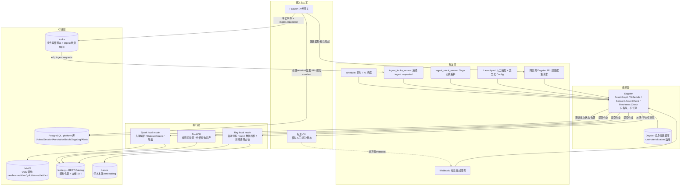
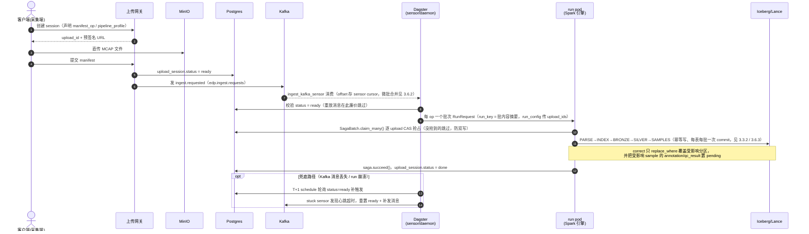
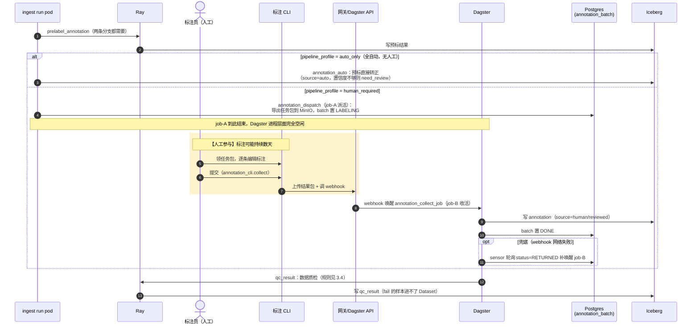
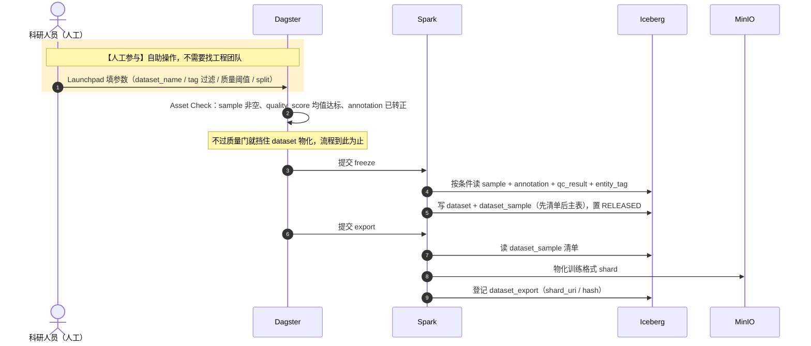
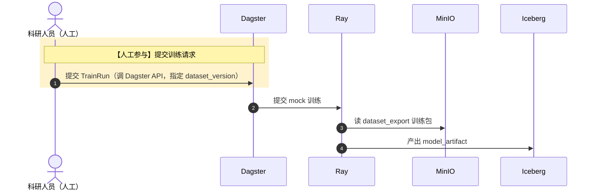
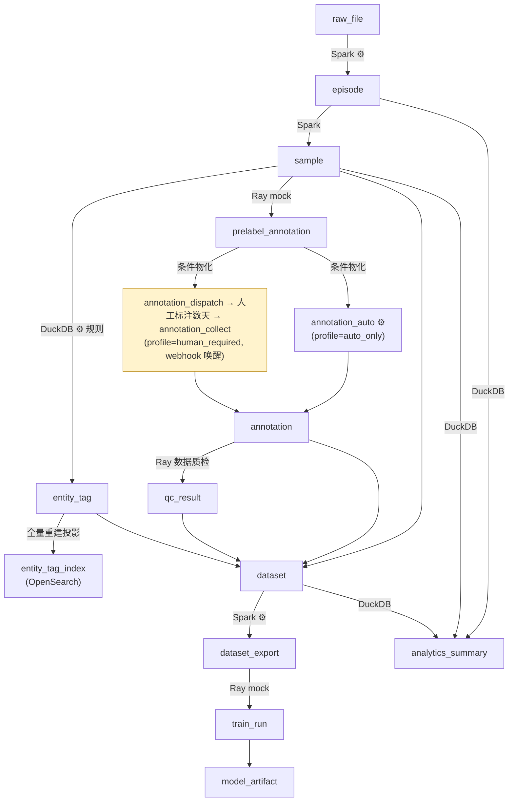

# EDP （数据平台 MVP）

本仓库是我博客《云平台及遥操设计》一文第四节"数据平台"的 MVP 实现。原文设计的是对标 PB 级数据量、多团队协作的完整生产架构；这个仓库实际上是想做一个最小可用版本出来，验证可行性。这个如果是纯粹研发，推荐使用docker composer，当然如果乐意使用minikube也不是不行。

---

## 一、功能

EDP MVP 沿着数据平台的主线提供以下能力：

```text
UploadSession -> RawFile -> Episode -> [自动预标] -> Sample -> [人工标注 + 质检] -> Dataset -> [导出训练格式] -> TrainRun -> ModelArtifact
```

**这条主线不是一条写死的流水线。** 同一批数据是否要人工标注、是新增采集还是对历史数据的修正，都会因批次而异，说白了，毕竟给业务服务


| 能力            | 说明                                                                                    | 主要面向角色               |
| ------------- | ------------------------------------------------------------------------------------- | -------------------- |
| 数据上传与入湖       | 客户端创建上传会话、直传原始文件（MCAP 等）、提交 manifest，系统自动解析成结构化的 `episode`/`sample`                   | 工程团队 / 采集端           |
| 灵活流程编排        | 按 `manifest.op`（新增/修正）和 `pipeline_profile`（全自动/需人工）两个正交维度组合出不同处理路径，新增一种路径不需要改已有代码     | 工程团队 / 科研人员          |
| 自动预标（mock）    | 对新样本跑一个"假模型"，产出预标注，占位真实 VLM/检测模型的接口位置                                                 | 工程团队                 |
| 自动数据质检        | 对每个样本窗口检查两条硬规则：滑动窗口内 imu/pose 频率 ≥ 8Hz、位姿相邻位移 ≤ 0.5m（详见 3.4），fail 的样本被 Dataset 冻结挡在门外 | 工程团队 / 科研人员          |
| 人工标注与质检闭环     | 派活（导出待标任务包）→ 人工标注（MVP 用 CLI 脚本模拟）→ 收活（导入结果 + 自动质检 + 抽检）                               | 科研人员 / 标注方           |
| 处理策略可插拔       | 清洗/打标签/质检等步骤的具体算法由策略注册表解析，替换算法只改配置不改编排图                                               | 科研人员 / 工程团队          |
| Tag 自由组织      | 声明式/规则/模型/人工四种来源的标签，用于圈数据、建 Dataset                                                   | 科研人员                 |
| Dataset 冻结发布  | 按过滤条件 + 质量阈值挑样本，生成不可变、带版本和 hash 的 Dataset                                             | 科研人员                 |
| 训练格式导出        | 把 Dataset 清单物化成可被 dataloader 消费的 shard                                                | 科研人员                 |
| 训练/评测消费（mock） | 一个占位作业读取导出包，产出 `model_artifact`，验证消费侧接口                                               | 科研人员                 |
| 端到端血缘反查       | 给一个 `dataset_version`，能一路 SQL join 回具体原始文件                                            | 全员                   |
| 自助数据探索        | 通过 Dagster 的 Asset Catalog 浏览"有什么数据、怎么来的"，通过 DuckDB 直接查 Iceberg 表做分析                  | 科研人员（自服务，减少对工程团队的依赖） |
| 运行状态可观测       | 在 Dagster UI 上看到每次运行的成功/失败/重试、数据新鲜度、质量门是否通过，且能直接分辨一次运行走的是哪条处理路径                       | 全员                   |


---

## 二、架构设计

### 2.1 设计描述

在我个人看来，数据平台根本要解决的是，工作流编排+数据血缘治理。通过CRUD检索数据的部分比较简单，这个实际上归属于数据血缘治理。

工作流编排里面，要解决：一次采集的数据从落地到能被训练消费，中间要经过清洗、标注、质检、组织、发布、导出这么多环节，这些环节该由谁处理（执行引擎）、什么时候处理（触发时机）、怎么执行？
数据血缘治理，要解决的问题是数据的关系是什么？元信息如何存储，检索？当然，也可以说，数据如何存储，如何管理？

因此，如果从架构的层面来说，我理解实际上可以简单拆分为三层。那么设计原则就自然而然的有了


| 层       | 回答什么              | 本仓库的实现                                                                           |
| ------- | ----------------- | -------------------------------------------------------------------------------- |
| **编排层** | 按什么顺序、依赖、重试串起来    | **Dagster**（监听触发事件，同时指挥执行流，不计算）                                                  |
| **执行层** | 真正算               | **Spark local**（大批量结构化）/ **DuckDB**（小批量+分析查询）/ **Ray**（数据质检 + GPU/ML 形态占位）       |
| **存储层** | 数据落在哪，数据的血缘关系如何体现 | MinIO（对象存储）/ Iceberg（结构化表+血缘）/ Lance（多模态样本本体）/ PostgreSQL（业务瞬态状态）/ Kafka（业务事件账本） |


### 2.2 设计原则

1. **编排层面：**
  1. **编排器只做控制面，不跑计算**：Dagster 的 asset 函数体里只做参数准备和结果校验，真正的计算全部委托给 Spark/DuckDB/Ray 子进程或作业，编排器进程本身可以随时重启不丢数据。
  2. **触发方式多样，但全部收敛进编排器**：入湖的实时触发走 Kafka（网关提交 manifest 后发 `ingest.requested`，Dagster 的 Kafka consumer sensor 消费并按 `manifest_op` 路由）；定时兜底、人工点按钮、API 调用、Webhook 回调走 Dagster 原生机制。所有触发路径共用同一套 `run_key` 去重 + Saga 互斥（见 3.3），重复触发无害。
2. **执行层：**
  1. **根据待计算人物的强度决定用什么资源，不是什么都上 Spark**：结构化大批量→Spark；秒起秒停的小批量/分析查询→DuckDB；GPU/模型形态→Ray。任务只声明"要什么资源"，路由规则决定派给谁。
3. **存储曾：**
  1. **Iceberg commit 是数据唯一真相源**：一份数据算不算存在，以它有没有被 Iceberg 快照引用为准；其余存储（Kafka/Dagster 元数据）都是可重建的派生投影。
  2. **幂等写入，安全重试**：所有作业按批次/分区做 `MERGE`/`overwrite`，保证"至少一次 + 幂等 = 最终一致"，回填和重试永远安全；跨多张表、多次 commit 的流程（入湖）额外套一层前向恢复型 Saga（`common/saga.py`，见 3.3），提供互斥抢占、心跳、断点定位和显式终态。注意，这里包括ID也必须是幂等的！

### 2.3 架构图




### 2.4 组件清单


| 分类        | 组件                                              | MVP 实现                                             | 职责                                                                                 |
| --------- | ----------------------------------------------- | -------------------------------------------------- | ---------------------------------------------------------------------------------- |
| 编排        | Dagster                                         | `dagster` + `dagster-webserver` + `dagster-daemon` | 统一调度三类执行引擎；schedule/sensor/API 触发；asset 版本、血缘、质量门、新鲜度、重试、回填、UI                     |
| 批处理执行     | Spark                                           | Spark local mode + Iceberg runtime                 | 分层解析、清洗、Dataset freeze、指标聚合、写 Iceberg                                              |
| 小批量/分析执行  | DuckDB                                          | Python `duckdb` + Iceberg extension                | 规则打标签（小批量增量）、直接查 Iceberg 做分析类资产                                                    |
| GPU/ML 执行 | Ray                                             | Ray local mode，`@ray.remote`                       | 自动预标（mock）、自动数据质检（真实规则，见 3.4）、训练/评测占位                                              |
| 对象存储      | MinIO                                           | 单节点                                                | Raw/Bronze/Silver/Gold/Dataset/Artifact 分区                                         |
| 表格式与目录    | Iceberg + REST Catalog                          | Lakekeeper（或 Apache Polaris，二选一）                   | 结构化表管理，ACID、快照、时间旅行，血缘 SoT                                                         |
| 多模态存储     | Lance                                           | 本地/MinIO 后端                                        | 样本本体、预标 embedding，被 Iceberg 表指针引用                                                  |
| 业务状态存储    | PostgreSQL（`platform` 库）                        | 独立 schema，与 Dagster 自身元数据库（`dagster` 库）分开          | UploadSession、AnnotationBatch、SagaLog、Alerts、DatasetRequest                        |
| tag 检索     | OpenSearch + Dashboards                         | 单节点 2.19，security 关闭                               | Iceberg `entity_tag` 的派生检索投影（`flat_object` 承接任意 key）；Dashboards 是人用的复合查询界面，gateway `/search/tags` 是程序接口，见 3.5 |
| 业务事件 + 触发 | Kafka                                           | 单节点 KRaft                                          | `edp.events` 事实账本（可重放）；`edp.ingest.requests` 专用触发 topic，由 Kafka consumer sensor 消费 |
| 接入网关      | FastAPI                                         | 常驻服务                                               | 鉴权占位、创建会话、签发 MinIO 预签名 URL、接收 manifest、转发建数据集/标注完成请求给 Dagster API                  |
| 人工标注      | CLI 脚本                                          | Python 命令行工具                                       | 模拟"导出待标任务包 → 人工编辑 → 提交结果并调 webhook"，接口边界对齐未来接 Label Studio/CVAT                    |
| 策略注册表     | `pipeline_step_config` 表（Postgres `platform` 库） | 1 个默认策略 + 1 个备用策略                                  | 每个处理阶段（清洗/打标签/质检/导出）按 `strategy_id` 解析出具体执行的函数/脚本，新增策略只加配置不改编排图                    |
| 合成数据      | 数据生成器 / 真实样本                                    | Python 脚本 + `mcap` 库；也支持直接放入真实 MCAP 样本文件           | 生成带 imu/pose 两个 topic 的 MCAP 文件；提供 `--dropout-seconds` / `--pose-jump` 故障注入开关验证质检  |
| 云上部署      | Kubernetes（minikube）                            | `deploy/k8s/` 全套 manifest + `Dockerfile`（单镜像多角色）   | `data` namespace；`K8sRunLauncher` 把每个 run 起成独立 Job pod，见 5.3                       |


---

## 三、详细设计

### 3.1 关键数据结构

数据表分别存储于两个位置，Iceberg 与 Postgres：

- **Iceberg 存储数据事实**：已发生、需要回放/审计/大规模扫描的事实数据（标注内容、质检结论、样本索引）。
- **Postgres 存储业务瞬态状态**：当前时刻的状态，被高频 UPDATE、需要毫秒级点查与行级事务/锁（上传是否 ready、锁被谁持有、标注进行到哪一步）。

总之 **Iceberg 是 SoT，Postgres 是业务状态，可重建**。PG 里的每张表理论上都能从 Iceberg 快照 + Kafka 事件重放推出来，反过来不行。两边靠 `upload_id` 和审计列 `_run_id` 互相引用，但谁都不替对方做主（4.7 节 SoT 域划分）。

#### 3.1.1 Iceberg 表（数据事实，SoT）

Schema 统一定义在 `schemas/iceberg_tables.py`，每张表的主键即幂等写入的 upsert 键；所有表均附带 4 个审计列（见 3.1.3），下文字段表中不再重复列出。

全平台 ID 均为**确定性派生**：`upload_id → episode_id ("ep-{upload_id}") → sample_id ("{episode_id}-w{窗口序号}") → anno_id / qc_id`。同一批数据无论重跑多少次，生成的 ID 完全一致，这既是幂等 upsert 与 Saga 前向恢复（3.3）的前提，也使血缘关系直接编码在 ID 与主外键中（血缘查询方法见 3.1.3）。

##### 3.1.1.1 Medallion 分层表（信号数据，规模最大）

MVP 仅实现 imu 一条 topic 的 Bronze/Silver 以验证分层机制；pose topic 不建分层表，仅由质检（3.4）直接读取原始文件。

| 层      | 表                   | 产生方                                     | 写入方式                                          |
| ------ | ------------------- | --------------------------------------- | --------------------------------------------- |
| Raw    | 原始文件（MinIO 原样存放，不建表） | 客户端直传                                   | 只追加，平台不修改                                     |
| Bronze | `bronze_imu`        | ingest 的 BRONZE 步                       | `replace_where(episode_id=…)` 单 commit 覆盖     |
| Silver | `silver_imu`        | ingest 的 SILVER 步（清洗策略见 3.1.2.2）        | 同上                                            |
| Gold   | `gold_sample_index` | ingest 的 SAMPLES 步                      | 按 `sample_id` upsert                          |

这个表实际上我感觉如果不做定量分析的话实际上不一定用到，起码有的厂子（某中心）肯定是

设计要点：

- **Bronze 保留原始载荷 `payload_json`**：清洗逻辑变更时可直接由 Bronze 重建 Silver，无需回到原始文件重新解析，即分层"可重建"的具体含义。
- **Bronze/Silver 是全平台数据量最大的表，不参与 MERGE**：新增走 append，修正走 `replace_where` 范围覆盖，按 `day(ts)` 分区（见 4.6）。

`bronze_imu`（原始信号逐条落表，分区 `day(ts)`）：

| 字段             | 类型        | 说明             |
| -------------- | --------- | -------------- |
| `robot_id`     | STRING    | 采集机器人          |
| `episode_id`   | STRING    | 归属 episode     |
| `source_file`  | STRING    | 来源 MCAP 文件 URI |
| `ts`           | TIMESTAMP | 消息时间戳          |
| `seq`          | LONG      | 消息序号           |
| `payload_json` | STRING    | 原始消息，JSON 编码   |

`silver_imu`（清洗对齐后的信号，分区 `day(ts)`）：

| 字段                 | 类型        | 说明            |
| ------------------ | --------- | ------------- |
| `episode_id`       | STRING    | 归属 episode    |
| `robot_id`         | STRING    | 采集机器人         |
| `ts`               | TIMESTAMP | 消息时间戳         |
| `ax` / `ay` / `az` | DOUBLE    | 加速度三轴         |
| `gx` / `gy` / `gz` | DOUBLE    | 角速度三轴         |
| `quality_flag`     | STRING    | 清洗策略输出的行级质量标记 |

`gold_sample_index`（样本级统计侧影）：

| 字段              | 类型     | 说明          |
| --------------- | ------ | ----------- |
| `episode_id`    | STRING | 归属 episode  |
| `sample_id`     | STRING | **主键**      |
| `duration_s`    | DOUBLE | 样本时长（秒）     |
| `num_points`    | LONG   | 数据点数        |
| `quality_score` | DOUBLE | 质量分         |

##### 3.1.1.2 索引/目录表

索引表行数与"采集批次/样本"同量级（百万级），远小于信号表，因此可安全参与 MERGE。

`raw_file`（原始文件登记）：入湖第一站是"登记"而非"搬运"，文件本体保留在 MinIO，本表回答"平台接收过哪些文件、完整性如何"。由 ingest 的 INDEX 步产生，按 `file_uri` upsert；`status=quarantined` 使校验失败的文件留痕而非静默丢弃（类似 lazy delete）。

| 字段                     | 类型        | 说明                          |
| ---------------------- | --------- | --------------------------- |
| `file_uri`             | STRING    | 对象存储路径，**主键**               |
| `robot_id` / `task_id` | STRING    | 采集上下文                       |
| `start_ts` / `end_ts`  | TIMESTAMP | 文件覆盖的时间区间                   |
| `sha256`               | STRING    | 内容指纹，用于完整性校验                |
| `schema_version`       | STRING    | 数据格式版本                      |
| `upload_id`            | STRING    | 所属上传事务，关联 PG `upload_session` |
| `status`               | STRING    | `ok` / `quarantined`        |

`episode`（一次连续采集的语义单元）：主键 `episode_id = "ep-{upload_id}"`（MVP 简化为一次上传对应一个 episode；manifest 结构已为一次上传声明多个 episode 预留）。一行对应一整段采集（可能几十 GB 原始数据），因此表极薄，MERGE 代价恒定。分区 `day(start_ts) + robot_id`，对齐数据"按天、按机器人"到达的写入模式（2.2 原则 10）。由 ingest 的 INDEX 步产生。

| 字段                                         | 类型        | 说明                             |
| ------------------------------------------ | --------- | ------------------------------ |
| `episode_id`                               | STRING    | **主键**，确定性派生自 `upload_id`      |
| `robot_id` / `task_id` / `operator`        | STRING    | 采集上下文                          |
| `start_ts` / `end_ts`                      | TIMESTAMP | 采集时间区间                         |
| `firmware_ver` / `calib_ver` / `agent_ver` | STRING    | 复现性字段：记录该段数据由什么固件/标定/程序版本采集    |
| `source`                                   | STRING    | `declared` / `auto` / `manual` |

`episode_file`（episode 与 raw_file 的多对多关联）：一个 episode 可能拆分为多个 MCAP 文件；质检重新解析原始流时按 `ordinal` 顺序拼接。由 ingest 的 INDEX 步产生。

| 字段           | 类型     | 说明          |
| ------------ | ------ | ----------- |
| `episode_id` | STRING | **复合主键之一**  |
| `file_uri`   | STRING | **复合主键之一**  |
| `ordinal`    | LONG   | 文件在采集流中的顺序号 |

`sample`（训练/评测样本索引，本体在 Lance）：主键 `sample_id = "{episode_id}-w{窗口序号}"`，窗口序号按"距 episode 起点的第几个 2 秒窗"计算（`bucket_by_window`），因此修正重跑时同一时间段命中同一 `sample_id`，upsert 覆盖而非新增。由 ingest 的 SAMPLES 步产生。

| 字段                  | 类型        | 说明                                  |
| ------------------- | --------- | ----------------------------------- |
| `sample_id`         | STRING    | **主键**，确定性窗口编号                      |
| `episode_id`        | STRING    | 外键，关联 `episode`                     |
| `robot_id`          | STRING    | 从 episode 反规范化的分区键，MERGE/裁剪无需 join  |
| `event_date`        | TIMESTAMP | 同上；分区为 `day(event_date) + robot_id` |
| `slicer_version`    | STRING    | 切片方案版本，切法变更后可区分新旧样本                 |
| `lance_uri`         | STRING    | 样本本体位置：表存指针与可过滤元信息，多模态本体存 Lance     |
| `quality_score`     | DOUBLE    | 综合质量分                               |
| `quality_tags_json` | STRING    | 分维度质量分，JSON 编码                      |

##### 3.1.1.3 标注与质检表

`annotation`（标注事实）：主键 `anno_id`，确定性派生（`{sample_id}-prelabel` / `{sample_id}-human`）。核心设计是**预标、自动转正、人工三个来源写同一张表，以 `source` 列区分**，下游（质检、冻结）只需查一张表，数据模型不因流程分支而分裂。产生链：`prelabel.py` 写入 `-prelabel` 行（`source=auto, review_status=pending`）；auto_only 分支由 `annotation_auto.py` 按置信度将同一行 upsert 为 `passed`；human_required 分支由 `annotation_collect` 另写 `-human` 行（`source=human`）。全部按 `anno_id` upsert。

| 字段                          | 类型     | 说明                                                          |
| --------------------------- | ------ | ----------------------------------------------------------- |
| `anno_id`                   | STRING | **主键**，确定性派生                                                |
| `target_type` / `target_id` | STRING | 标注对象：episode / sample（泛化设计）                                 |
| `type`                      | STRING | `lang` / `segment` / `success` / `quality`                  |
| `value_or_uri`              | STRING | 标注内容，大对象存 URI                                               |
| `source`                    | STRING | `auto` / `human` / `reviewed`，流程分支的落表痕迹                     |
| `anno_version`              | STRING | 标注方案版本                                                      |
| `review_status`             | STRING | `pending` / `passed` / `rejected`；`ingest_correct` 打回重审时改此列 |
| `confidence`                | DOUBLE | 仅 `source=auto` 时有意义，驱动"置信度不足转人工"的分支判断                       |

`qc_result`（质检结论）：代理主键 `qc_id = "{sample_id}-data-qc"`，保证按行 upsert 幂等。由 `engines/ray/qc.py` 按 3.4 的两条规则检查后写入；Dataset 冻结仅接收 `verdict='pass'` 的样本。之所以落表而非使用 Dagster asset check：质检结论是**样本级、需参与 SQL join 的事实数据**；批次级门禁（行数、均值等）才使用 asset check（挂在物化上，结果存 Dagster 元数据库）。

| 字段           | 类型     | 说明                             |
| ------------ | ------ | ------------------------------ |
| `qc_id`      | STRING | **主键**，确定性派生                   |
| `target_id`  | STRING | 被检对象，通常为 `sample_id`           |
| `check_type` | STRING | `data`（数据质检）/ `annotation`（标注质检） |
| `verdict`    | STRING | `pass` / `fail` / `need_review` |
| `score`      | DOUBLE | 质检得分                           |
| `checked_by` | STRING | `auto` / 质检人员标识                |

> 遗留：`annotation_task`（Iceberg）已建表但当前无代码读写，批次状态实际由 PG 的 `annotation_batch` 承担，待清理。

##### 3.1.1.4 Tag 表

`entity_tag`：复合主键 `(target_type, target_id, tag_key)`，同一对象同一 key 仅有一个值，重新打标即覆盖。`tag_key/tag_value` 采用全 string 的 KV 泛化设计：key 不预定义 schema，作为圈选数据的主要维度；代价是数值比较需 cast（数值范围条件走湖上查询）。由 `engines/duckdb/entity_tag.py` 按规则策略（3.1.2.2）增量打标。key=value 组合的**快速检索**不直接扫这张表，而是走 OpenSearch 投影（3.5）。

| 字段            | 类型        | 说明                                          |
| ------------- | --------- | ------------------------------------------- |
| `target_type` | STRING    | **复合主键之一**，episode / sample                 |
| `target_id`   | STRING    | **复合主键之一**                                  |
| `tag_key`     | STRING    | **复合主键之一**，标签名                              |
| `tag_value`   | STRING    | 标签值，统一 string 编码                            |
| `source`      | STRING    | `declared` / `rule` / `model` / `human`，标签来源，支持按可信度过滤 |
| `tagged_by`   | STRING    | 打标者（策略 ID 或人员）                              |
| `tagged_at`   | TIMESTAMP | 打标时间                                        |
| `robot_id`    | STRING    | 反规范化分区键                                     |

`tag_def`（词表治理）：登记 `tag_key` 的合法值域与负责人，防止标签退化为无人维护的自由文本。MVP 仅登记，不强制校验。

| 字段                    | 类型     | 说明            |
| --------------------- | ------ | ------------- |
| `tag_key`             | STRING | **主键**，标签名    |
| `allowed_values_json` | STRING | 合法值域，JSON 数组  |
| `owner`               | STRING | 负责人           |
| `description`         | STRING | 标签含义说明        |

##### 3.1.1.5 业务发布层表（Dataset 及消费链）

这一组表构成"冻结 → 导出 → 训练"的登记链，每张都薄，作用是让血缘反查的每一跳都有表可 join：

| 表                        | 主键                                | 产生方                            | 设计要点                                       |
| ------------------------ | --------------------------------- | ------------------------------ | ------------------------------------------ |
| `dataset`                | `(dataset_name, dataset_version)` | `freeze_dataset.py`            | 不可变发布物，`state` 仅允许 RELEASED→DEPRECATED     |
| `dataset_sample`         | `(name, version, sample_id)`      | 同上，**先于主表写入**（主表出现即代表清单完整）     | **既是清单也是权威血缘**：训练用了哪些样本以此表为准               |
| `dataset_export`         | `dataset_version + format`        | `export_dataset.py`            | 物化出的训练 shard 登记                            |
| `train_run` / `eval_run` | `run_id`                          | `mock_train.py`                | 训练/评测消费侧接口占位                               |
| `model_artifact`         | `model_id`                        | 同上                             | 产物元数据，`run_id + dataset_version` 双外键闭合血缘链  |
| `analytics_summary`      | `summary_id`                      | `analytics_summary.py`（DuckDB） | 分析指标同样作为有血缘的数据产物落表                         |

`dataset`（冻结的、不可变的样本集合）：

| 字段                 | 类型     | 说明                                    |
| ------------------ | ------ | ------------------------------------- |
| `dataset_name`     | STRING | **复合主键之一**                            |
| `dataset_version`  | STRING | **复合主键之一**                            |
| `manifest_hash`    | STRING | 样本清单指纹                                |
| `filter_expr_json` | STRING | 冻结当时的圈选条件，JSON 编码，用于审计                |
| `code_ver`         | STRING | 冻结时的代码版本                              |
| `state`            | STRING | `BUILDING` / `RELEASED` / `DEPRECATED` |

`dataset_sample`（样本引用清单）：

| 字段                | 类型     | 说明                          |
| ----------------- | ------ | --------------------------- |
| `dataset_name`    | STRING | **复合主键之一**                  |
| `dataset_version` | STRING | **复合主键之一**                  |
| `sample_id`       | STRING | **复合主键之一**，关联 `sample`      |
| `split`           | STRING | `train` / `val` / `test`，冻结时按比例分配 |

`dataset_export`（导出的训练格式包）：

| 字段                | 类型     | 说明             |
| ----------------- | ------ | -------------- |
| `dataset_version` | STRING | 关联 `dataset`   |
| `format`          | STRING | 导出格式           |
| `shard_uri`       | STRING | shard 存放位置     |
| `num_shards`      | LONG   | shard 数量       |
| `hash`            | STRING | 导出包指纹          |

`train_run` / `eval_run`（mock 训练/评测任务，两表同构）：

| 字段                | 类型     | 说明               |
| ----------------- | ------ | ---------------- |
| `run_id`          | STRING | **主键**           |
| `dataset_version` | STRING | 消费的数据集版本         |
| `code_ver`        | STRING | 训练/评测代码版本        |
| `params_json`     | STRING | 任务参数，JSON 编码     |
| `metrics_json`    | STRING | 结果指标，JSON 编码     |
| `state`           | STRING | 任务状态             |

`model_artifact`（模型产物元数据）：

| 字段                | 类型     | 说明                 |
| ----------------- | ------ | ------------------ |
| `model_id`        | STRING | **主键**             |
| `run_id`          | STRING | 外键，产出该模型的训练任务      |
| `dataset_version` | STRING | 外键，训练所用数据集版本       |
| `format`          | STRING | 模型格式               |
| `artifact_uri`    | STRING | 产物存放位置             |

`analytics_summary`（DuckDB 分析资产的物化结果）：

| 字段             | 类型        | 说明                           |
| -------------- | --------- | ---------------------------- |
| `summary_id`   | STRING    | **主键**                       |
| `scope`        | STRING    | 统计口径：episode / sample / dataset |
| `metric_name`  | STRING    | 指标名                          |
| `metric_value` | DOUBLE    | 指标值                          |
| `computed_at`  | TIMESTAMP | 计算时间                         |

#### 3.1.2 Postgres 表（业务瞬态状态）

DDL 定义在 `schemas/postgres_platform.sql`。放 PG 的共同原因：这些表是被高频 UPDATE 的状态机，依赖行级事务/CAS 与毫秒级点查——Iceberg 的 commit 是文件级快照，不适合承载此类 OLTP 负载。反之它们也不作为 SoT："数据是否存在"始终以 Iceberg 为准；PG 数据丢失后可由 Iceberg 快照 + Kafka 事件重放重建（代价是丢失"正在进行中"的瞬态，重放后卡住的批次由 stuck sensor 收敛）。

##### 3.1.2.1 业务状态表

| 表                  | 主键                     | 作用                                     | 读写方                                                                             |
| ------------------ | ---------------------- | -------------------------------------- | ------------------------------------------------------------------------------ |
| `upload_session`   | `upload_id`            | 上传事务状态机，**触发系统的枢纽**                    | 网关写 ready；Kafka sensor 校验 ready；Saga 收尾改 done；stuck sensor 依据 `updated_at` 判定悬置 |
| `saga_log`         | `(scope, business_id)` | 每行即一把互斥锁 + 步骤断点，3.3 节三原语的载体            | 引擎 claim/advance/succeed/fail；stuck sensor 读心跳                                  |
| `annotation_batch` | `batch_id`             | 人工标注批次状态机，"等人期间"平台记录进度的位置              | dispatch 写 LABELING；CLI webhook 置 RETURNED；collect 置 DONE                       |
| `dataset_request`  | `request_id`           | "建数据集"API 请求的受理记录                      | 网关写入；freeze 更新状态                                                                |
| `alerts`           | `alert_id`             | 告警通道：重试耗尽、Saga 终失败等异常落表待人工处理           | stuck sensor / 引擎写入；人工消费                                                        |

`upload_session`（上传事务状态机）：其中 `manifest_op` 与 `pipeline_profile` 是两个**正交的流程开关**——它们是"这批数据如何处理"的指令，属于瞬态配置，因此在 PG 而非 Iceberg。

| 字段                 | 类型          | 说明                                                                     |
| ------------------ | ----------- | ---------------------------------------------------------------------- |
| `upload_id`        | TEXT        | **主键**，网关生成                                                            |
| `robot_id` / `task_id` / `operator` | TEXT | 采集上下文                                                    |
| `manifest_op`      | TEXT        | `append`（新增采集）/ `correct`（修正已有分区），决定路由到哪个 ingest job（3.2.1）            |
| `pipeline_profile` | TEXT        | `auto_only`（全自动）/ `human_required`（需人工），决定标注阶段走哪条分支（3.2.2）              |
| `status`           | TEXT        | `created → uploading → ready → ingesting → done / failed`              |
| `manifest_uri` / `manifest` | TEXT / JSONB | manifest 存放位置及内容快照                                            |
| `created_at` / `updated_at` | TIMESTAMPTZ | 审计时间戳；`updated_at` 兼作悬置判定依据                                    |

`saga_log`（Saga 执行日志，详见 3.3）：

| 字段            | 类型          | 说明                                          |
| ------------- | ----------- | ------------------------------------------- |
| `scope`       | TEXT        | **复合主键之一**，业务流程名：`ingest_append` / `ingest_correct` |
| `business_id` | TEXT        | **复合主键之一**，业务主键，即 `upload_id`               |
| `run_id`      | TEXT        | 当前 owner 的 Dagster run_id，即 fencing token   |
| `status`      | TEXT        | `RUNNING` / `SUCCEEDED` / `FAILED`          |
| `step`        | TEXT        | 最近推进到的步骤，`advance()` 时更新，兼作心跳               |
| `attempt`     | INT         | 尝试次数，claim 接管时递增，用于限制自动重试                   |
| `error`       | TEXT        | 最近一次失败原因                                    |
| `started_at` / `updated_at` | TIMESTAMPTZ | 起始时间 / 心跳时间                     |

`annotation_batch`（人工标注批次状态机）：`dispatch_run_id` 与 `collect_run_id` 将派活/收活两段独立 job 关联起来。

| 字段                | 类型          | 说明                                                        |
| ----------------- | ----------- | --------------------------------------------------------- |
| `batch_id`        | TEXT        | **主键**                                                    |
| `upload_id`       | TEXT        | 外键，关联 `upload_session`                                    |
| `sample_ids`      | JSONB       | 本批次覆盖的样本范围                                                |
| `prelabel_run_id` | TEXT        | 产生预标的 Dagster run                                         |
| `package_uri`     | TEXT        | 标注交付包位置（派出/回收复用同一字段）                                      |
| `status`          | TEXT        | `PRELABELING → PACKAGED → LABELING → RETURNED → QC → DONE` |
| `dispatch_run_id` / `collect_run_id` | TEXT | 派活/收活两段 job 的 run 关联                          |
| `created_at` / `updated_at` | TIMESTAMPTZ | 审计时间戳                                         |

`dataset_request`（数据集构建请求）：

| 字段                  | 类型               | 说明                                          |
| ------------------- | ---------------- | ------------------------------------------- |
| `request_id`        | TEXT             | **主键**                                      |
| `requested_by`      | TEXT             | 请求人                                         |
| `dataset_name`      | TEXT             | 目标数据集名                                      |
| `filter_expr`       | JSONB            | 圈选条件                                        |
| `quality_threshold` | DOUBLE PRECISION | 质量分门槛                                       |
| `split`             | JSONB            | train/val/test 比例                           |
| `status`            | TEXT             | `pending` / `building` / `released` / `failed` |
| `dataset_version`   | TEXT             | 构建成功后回填的版本号                                 |
| `dagster_run_id`    | TEXT             | 对应的冻结 run                                   |

`alerts`（告警记录）：

| 字段           | 类型        | 说明                             |
| ------------ | --------- | ------------------------------ |
| `alert_id`   | BIGSERIAL | **主键**                         |
| `severity`   | TEXT      | `info` / `warning` / `error`   |
| `source`     | TEXT      | 告警来源（sensor / 引擎名）             |
| `run_id`     | TEXT      | 关联的 Dagster run                |
| `message`    | TEXT      | 告警内容                           |
| `context`    | JSONB     | 结构化上下文                         |
| `acked`      | BOOLEAN   | 是否已被人工确认                       |

> 遗留：`ingest_job` 表无代码读写——其设想职责（记录 ingest 的 run 状态）已由 `saga_log` 承担，待删除。

##### 3.1.2.2 流程配置表（策略注册表）

`pipeline_step_config`：每个处理阶段实际执行哪个策略由这张表在运行时解析，新增策略只需增加一行配置，不改 Dagster 资产图。放 PG 的原因：它是配置而非事实，修改需即时生效、无需发版。

| 字段            | 类型      | 说明                                                                          |
| ------------- | ------- | --------------------------------------------------------------------------- |
| `stage`       | TEXT    | **复合主键之一**，处理阶段：`silver_clean` / `entity_tag` / `qc` / `annotation_promote` / `export` |
| `strategy_id` | TEXT    | **复合主键之一**，策略标识，资产运行时按 `(stage, strategy_id)` 查表                             |
| `entrypoint`  | TEXT    | `module:function` 字符串，运行时反射解析                                                |
| `owner`       | TEXT    | 策略负责人（自文档化）                                                                  |
| `is_default`  | BOOLEAN | 该 stage 未指定 `strategy_id` 时的默认策略                                             |
| `description` | TEXT    | 策略说明                                                                         |

MVP 登记 **1 个默认 + 1 个备用策略**证明机制可行；每次物化将实际解析到的 `strategy_id` 写入物化 metadata，不新增节点也能在 UI 上看出使用了哪个策略。

`runtime_config`（运行时参数，key/value 两列）：微批大小 `INGEST_BATCH_MAX`（默认 200）、背压上限 `INGEST_MAX_INFLIGHT_BATCHES`（默认 3）、保留天数 `RETENTION_DAYS`（默认 30），见 3.6.2/3.6.4。放 PG 的原因与策略注册表相同：`UPDATE` 后 sensor 下一个 tick 即生效，不用重启任何组件。

#### 3.1.3 审计列与血缘反查

**每一张 Iceberg 表均附带四个审计列**，这是全平台可追踪性的基础：

| 字段             | 类型        | 说明                              |
| -------------- | --------- | ------------------------------- |
| `_batch_id`    | STRING    | 业务批次号，如 `20260703-robotA-upload123` |
| `_run_id`      | STRING    | 产生该行数据的 Dagster run id          |
| `_ingested_at` | TIMESTAMP | 写入时间                            |
| `_source_uri`  | STRING    | 溯源到具体源文件/上游资产                   |

配合 3.1.1 的 ID 确定性派生，两个方向的血缘均为纯 SQL 查询：

- **正向（模型 → 原始文件）**：`model_artifact.dataset_version → dataset_sample.sample_id → sample.episode_id → episode_file.file_uri → raw_file`，每一跳都是主外键 join，不依赖任何运行时系统。
- **反向（任意一行数据 → 产生者）**：取该行的 `_run_id` 到 Dagster UI 检索 run（或查询 `dagster` 库 `runs` 表），即可获得当次运行的完整日志、物化 metadata 与触发者；`_source_uri` 直接指向源文件。

### 3.2 关键流程

> 时序图约定：`actor` 人形图标 = 人工角色；黄色底的段落 = **人工参与**（需要人操作/等人，全文搜"人工参与"可以定位所有人在环节点）；`alt`/`opt` 框 = 分支/兜底路径。

#### 3.2.1 上传入湖（Kafka 触发，按 `manifest_op` 路由到两个 job）

网关提交 manifest 后向专用 topic `edp.ingest.requests` 发一条 `ingest.requested`（`common/kafka_ledger.py:emit_ingest_request`），`ingest_kafka_sensor`（`orchestration/sensors.py`）消费它，按 `manifest_op` 把 `RunRequest` 路由到 `ingest_append_job` 或 `ingest_correct_job`——运行历史上直接看 job 名字就能分辨这次是新增采集还是数据修正。这一段**全自动，无人工参与**：




触发的可靠性模型是**至少一次 + 三层去重**（都在代码里，不靠约定）：

1. **Kafka offset 存在 sensor cursor 里**，与 `RunRequest` 的提交一起被 Dagster 持久化，不用 Kafka 自身的 group commit——避免"offset 提交了、run 没发出去"的缝隙；消息重放时 sensor 先查 PG，只有 `status=ready` 才进批（廉价跳过）。
2. **run_key = op + 批内容摘要**（批内所有 `upload_id:updated_at` 的有序哈希，`orchestration/sensors.py::_batch_run_key`）：Dagster 对同一个 run_key 只创建一次 run。`updated_at` 参与摘要是为了让"stuck 重试重置回 ready"能产生新 run_key。注意微批下批次成员不同 → run_key 不同，所以 run_key 只能挡住"完全相同的批"重复提交（同一路径重放）；Kafka sensor 与 T+1 兜底 schedule 两条路径之间的互斥主要靠 `status=ready` 过滤（sensor 拉起后引擎立刻置 ingesting，schedule 查不到）加下一层。
3. **引擎侧 `SagaBatch.claim_many()` 逐 upload CAS 互斥**（见 3.3 / 3.6.3）：就算前两层都被绕过，同一个 upload 也只有一个写者——没抢到的 upload 在批内被跳过，不算错误。

`ingest_append` 只新建/追加，`ingest_correct` 只对受影响的分区做范围限定的覆盖重写，并把受影响 `sample` 已有的 `annotation`/`qc_result` 标记为 `pending`——重新进入 3.2.2 节的标注流程，但走哪条分支仍由该批次的 `pipeline_profile` 决定。数据加工到 `sample` 为止。

#### 3.2.2 预标 + 标注 + 质检（按 `pipeline_profile` 条件物化分支，人在环）

这是编排最容易出问题的一段，两条原则叠加：**Dagster 不挂着干等，把"要等人"的部分切成"派活"和"收活"两个短 job**；**分支必须是图上独立的 asset，用条件物化表达，UI 才能看出这次走了哪条路**——不能写在一个函数的 if/else 里。




`annotation_auto` 和 `annotation_dispatch/annotation_collect` 是**两个独立命名的 Dagster asset**，只有其中一条会实际物化，另一条在 UI 上显示为 skipped——打开某个批次的运行记录就能一眼看出它走的是哪条路，但两条分支最终都写向同一张 Iceberg `annotation` 表（用 `source` 列区分 auto/human），数据模型不分裂。`annotation_dispatch` 结束后 Dagster 进程层面完全空闲；`annotation_collect` 由 CLI 提交时的 webhook 唤醒，或由一个兜底 sensor 轮询 `annotation_batch.status = RETURNED` 触发。

#### 3.2.3 冻结 Dataset + 导出




#### 3.2.4 训练/评测（mock）




不跑真训练，脚本读导出包、跑几秒、写产物，验证消费侧接口契约。

#### 3.2.5 综合资产依赖图（跨引擎，Dagster UI 上的实际形态）

这张图是 MVP 最想展示的东西——一张跨三种执行引擎、带条件分支、跨越"等人几天"的真实血缘图。图中带 `⚙` 的节点表示它的具体行为由 3.1.2.2 节的策略注册表解析，换算法只改配置、不改这张图的形状；两个 `annotation_*` 节点是同一次运行里只会亮其中一个的条件物化分支，黄色节点是唯一的**人工参与**环节（时序细节见 3.2.2）：




### 3.3 一致性：前向恢复型 Saga

一次 ingest 要依次写 7 张 Iceberg 表 + Lance 文件 + Postgres 状态，每张表的 commit 各自原子、但整体不是一个事务；同时触发侧有 Kafka sensor、T+1 兜底、stuck 重试三条路径，同一个 `upload_id` 可能被并发拉起两个 run。Saga（`common/saga.py`）解决的就是这两个问题：**中途崩溃可恢复、并发触发不双写**。完整推演见 `docs/saga-consistency-guide.md`。

#### 3.3.1 saga_log 表与三个原语

`saga_log` 以 `(scope, business_id)` 为主键（如 `('ingest_append', 'upl-xxx')`），一行就是一把锁 + 一份执行日志：


| 字段           | 作用                                                                                |
| ------------ | --------------------------------------------------------------------------------- |
| `run_id`     | 当前 owner 的 Dagster run id，同时是 **fencing token**                                   |
| `status`     | `RUNNING` / `SUCCEEDED` / `FAILED`，显式终态，不存在"悬空"状态                                 |
| `step`       | 最近推进到的步骤（`CLAIM`/`PARSE`/`INDEX`/`BRONZE`/`SILVER`/`SAMPLES`/`COMMIT`），崩溃后可精确定位断点 |
| `attempt`    | 第几次尝试，claim 接管时 +1，达到 `SAGA_MAX_ATTEMPTS`（默认 3）停止自动重试                             |
| `updated_at` | 兼作**心跳**：advance 每次刷新；stuck sensor 靠它判断 owner 是否已死                                |


三个原语全部是单条 SQL 的条件更新，靠 Postgres 行级原子性保证正确，不需要额外的锁服务：

- `**claim()`——CAS 抢占**：`INSERT ... ON CONFLICT DO UPDATE ... WHERE status <> 'RUNNING' OR updated_at < now() - SAGA_TAKEOVER_MINUTES`。只有"没人跑过 / 上次已终结 / 上一个 owner 心跳超时"三种情况能抢到；`RUNNING` 且心跳新鲜时 `RETURNING` 为空 → 抛 `SagaConflictError`，本 run 立即放弃（这是并发触发下的预期行为，不是故障）。
- `**advance(step)`——推进 + 心跳 + fencing**：`UPDATE ... WHERE run_id = 我 AND status = 'RUNNING'`。一旦被新 owner 接管，这条 UPDATE 影响 0 行 → 抛 `SagaOwnershipLostError`，僵尸 run 在下一次写表**之前**自杀，不会和新 owner 交错写。
- `**succeed()` / `fail(error)`——显式终态**：同样带 `run_id` 条件；`fail` 返回 False 表示已被接管，此时本 run 不再改任何状态，把世界留给新 owner。

微批下的执行形态是 `SagaBatch`（同文件）：语义与三原语逐条版完全一致，只是每个阶段用一条 SQL 对整批刷（`claim_many` 返回抢到的子集、`advance_many` 返回仍归本 run 的子集、`fail_one` 逐条失败隔离），锁粒度仍是单个 `upload_id`——理由见 3.6.3。

#### 3.3.2 为什么是"前向恢复"而不是补偿回滚

Dagster 是资产为中心的编排，没有"逆向执行图"可言；更重要的是这里**每一步写入本身都是幂等可重写的**，重跑一遍就能把半成品覆盖成完整结果，不需要 undo：


| 步骤（step）  | 写什么                                       | 幂等手段（`common/iceberg.py`）                                                             |
| --------- | ----------------------------------------- | ------------------------------------------------------------------------------------- |
| `PARSE`   | 解析 MCAP，纯读                                | —                                                                                     |
| `INDEX`   | `raw_file` / `episode` / `episode_file`   | pyiceberg 0.9 原生 `Table.upsert`（单 commit 的 MERGE）                                     |
| `BRONZE`  | `bronze_imu`                              | `replace_where`：`Table.transaction()` 里 delete(episode_id) + append，**单 commit** 原子换段 |
| `SILVER`  | `silver_imu`                              | 同上                                                                                    |
| `SAMPLES` | Lance 文件 + `sample` / `gold_sample_index` | Lance `mode=overwrite`（同 uri 覆盖）；表走 upsert                                            |
| `COMMIT`  | `upload_session.status = done`            | 由 `run()` 外壳统一落状态                                                                     |


崩在任何一步，效果都是"前缀完整、后缀缺失"，新 attempt 从头重跑：已写过的步骤被等值覆盖，缺失的步骤被补上。`replace_where` 是关键——如果 delete 和 append 是两次独立 commit，崩在中间会出现"旧数据删了、新数据没写"的丢数据窗口，事务内单 commit 把这个窗口消掉了。

#### 3.3.3 崩溃恢复与读侧隔离

- **恢复路径**：`ingest_stuck_sensor`（60s 一轮）找 `status=ingesting` 且 saga 心跳超过 `SAGA_TAKEOVER_MINUTES`（默认 30）的会话——owner 大概率已死。`attempt` 未达上限 → 把 session 重置回 `ready`（`updated_at` 刷新 → 新 run_key）并补发一条 `ingest.requested`；达到上限 → saga/session 都落 `FAILED` 终态 + 写 `alerts`，等人工介入。就算这个判断和一个"其实还活着"的旧 run 撞车，新 run 的 `claim()` CAS 也只允许一个写者。
- **读侧隔离**：Iceberg 没有跨表事务，"前缀完整"的中间态对下游可见。约定是**读侧过滤**：`common/saga.py:uncommitted_episode_ids()` 返回业务上尚未 `done` 的 episode 集合，`entity_tag` / `analytics_summary` 等下游资产查询时排除它们——半成品数据不进标签和统计，session 到 `done` 后下一轮自动补上。

### 3.4 数据质检规则（`engines/ray/qc.py`）

质检是策略注册表 `qc` stage 的默认策略 `qc_default`，对每个 sample（2 秒窗口）检查两条硬规则，产出 `qc_result(check_type=data)`；`verdict != pass` 的样本会被 Dataset 冻结的过滤条件挡在门外（`engines/spark/freeze_dataset.py` 只选 `verdict = 'pass'`）：


| 规则                                                                                    | 阈值（代码常量）                                                                      | 抓什么问题                                    |
| ------------------------------------------------------------------------------------- | ----------------------------------------------------------------------------- | ---------------------------------------- |
| **滑动窗口频率**：在 sample 窗口内以 1s 窗口、0.5s 步长滑动，`imu` / `pose` 每个 topic 在**每个**滑动窗口内的频率都必须达标 | `MIN_TOPIC_HZ = 8.0`（标称 10Hz 的 80%），`FREQ_WINDOW_S = 1.0`，`FREQ_STEP_S = 0.5` | 掉帧、断流、传感器静默段——整窗平均频率可能达标，但滑动子窗口能定位到局部的坏段 |
| **位姿连续性**：`pose` topic 相邻两条消息的位移距离 `‖Δ(px,py,pz)‖` 不得超限                               | `MAX_POSE_STEP_M = 0.5`（10Hz 下相当于 5m/s 的瞬时速度上限）                               | 定位跳变、坐标系错乱、时间戳错序——都表现为一步"瞬移"             |


实现要点：

- **数据源是 raw 层的原始 MCAP**（`episode_file` → MinIO），不是清洗后的 silver：质检针对"采集回来的数据本身"，结论不随清洗策略变化；`pose` topic 也只在这里消费，不参与 bronze/silver 分层（分层表是 imu 专属的）。
- **窗口锚点与切片器一致**：`sample_id = {episode_id}-w{idx}`，窗口 = `episode.start_ts + idx × 2s`，和 `bucket_by_window` 同一套定义，修正重跑后 QC 结论仍然对得上样本。
- **跨窗口边界的跳变不会漏**：检查连续性时把窗口前的最后一条 pose 也带上，跳变恰好落在两个窗口交界处时归属后一个窗口。
- **score 语义**：频率取"最差 topic 相对阈值的比例"，位姿取"阈值相对最大步长的比例"，两者取 min、封顶 1.0——score < 1 就能直接读出差多少。
- 每个 episode 一个 `@ray.remote` task 并行解析；结果按 `qc_id` upsert，重跑幂等。
- 换阈值/规则不改这段代码：按 3.1.2.2 在 `pipeline_step_config` 登记新策略指向别的函数即可。验证方式：`tools/datagen/generate.py` 的 `--dropout-seconds 3`（中段静默 3 秒 → 频率检查 fail）和 `--pose-jump`（中段瞬移 10m → 连续性检查 fail）两个故障注入开关。

### 3.5 Tag 检索投影（OpenSearch）

tag 可能打到任何 target（episode / sample / dataset …）上，key 不预定义、组合任意，需要"按若干 `key=value` 快速圈出对象"的检索能力。`entity_tag` 表的分区（`day(tagged_at) + robot_id`）是为写入优化的，对这类查询没有裁剪作用，直接扫湖只适合批处理场景。因此引入 OpenSearch 作为**派生检索投影**——定位与 PG 状态表一致：**SoT 仍在 Iceberg，投影可整体重建，丢了不算事故**。

#### 3.5.1 索引结构与同步链路

索引 `edp-entity-tag`（mapping 见 `common/search.py`）：**一个对象一个文档**，`_id = "{target_type}:{target_id}"`，所有 tag 聚成一个 `flat_object` 字段——任意多、任意名的 key 都不会撑爆 mapping，这正是"key 多变"场景在 OpenSearch 里的标准解法：

```json
{
  "target_type": "sample",
  "target_id": "ep-upl-xxx-w0001",
  "robot_id": "r-001",
  "tags":        { "quality_band": "high", "scene": "kitchen" },
  "tag_sources": { "quality_band": "rule", "scene": "human" },
  "num_tags": 2,
  "indexed_at": "..."
}
```

同步由资产 `entity_tag_index`（`engines/search/tag_index.py`）完成，在血缘图上紧跟 `entity_tag` 之后（3.2.5），入湖链路每次运行自动刷新。策略是**全量重建**：扫整张 `entity_tag` 按对象聚合、bulk 覆盖写（`_id` 确定性 → 幂等）。不做增量 diff 的原因：tag 是薄表，全量聚合秒级完成；换来的性质是**自愈**——投影丢失、落后、mapping 变更，重物化一次即收敛，与 4.7 的派生态原则完全一致。

#### 3.5.2 两个查询入口

| 入口 | 面向 | 用法 |
| --- | --- | --- |
| **OpenSearch Dashboards**（`:5601`） | 人，交互式复合检索 | Discover 界面选 `edp-entity-tag` 索引，DQL 直接写复合条件，如 `tags.quality_band: high and tags.scene: kitchen and target_type: sample`；也可以建可视化面板看 tag 值分布 |
| **gateway `POST /search/tags`** | 程序/脚本 | 请求体 `{"tags": {"quality_band": "high"}, "target_type": "sample"}`，条件间 AND；网关转成 `term` 过滤查 OpenSearch，毫秒级返回命中对象列表 |

能力边界：投影只承接**等值组合检索**（tag_value 全 string）；数值范围、跨表 join（如"tag=X 且质量分>0.8"）仍走湖上查询——Dataset 冻结的圈选逻辑（`freeze_dataset.py`）不变，OpenSearch 用于冻结前的探索和预览。检索命中的 `target_id` 拿回来即可按 3.1.3 的血缘链 join 湖里任何表。

### 3.6 容量设计：微批触发与背压

> **实施状态**：已实施。触发/背压在 `orchestration/sensors.py`，批量 Saga 原语在 `common/saga.py::SagaBatch`，批处理引擎在 `engines/spark/ingest_append.py::run_batch` / `ingest_correct.py::run_batch`，运行时参数在 PG `runtime_config` 表，保留清理在 `orchestration/retention.py`。

设计目标：日均 **6 万–18 万个上传事务**，集群容量有限（同时在跑的 run pod 数量有限）。核心结论一句话：**run 的数量由批次窗口决定，与上传量解耦；"怎么跑"以批为单位，"对不对账"以 upload 为单位。**

#### 3.6.1 为什么"一上传一 run"撑不住

| 压力点             | 一上传一 run（现状）                              | 微批后                          |
| --------------- | ----------------------------------------- | ---------------------------- |
| run / pod 数量    | 6–18 万个/天（平均 0.7–2 个/秒），pod 秒级启动开销追不上到达速率 | 常数个/天（由 tick 间隔与批次上限决定），容量可控 |
| Dagster 事件日志    | 每 run 数十行事件，每天数百万行进 PG                    | 随 run 数量降为常数量级               |
| Iceberg commit  | 每上传每表一次 commit，几十万次/天，小文件泛滥、catalog 提交冲突  | **每批每表一次 commit**            |
| Dagster 分区      | 若按 upload 建动态分区，几万个起 UI 即卡顿               | 不用动态分区，批次信息走 run_config/tags |

#### 3.6.2 微批触发与两层背压

`ingest_kafka_sensor` 保持定时 tick（30s 一轮），每轮：

```text
tick
 ├─ 1. 读 runtime_config（PG，运行时可改，UPDATE 后下个 tick 生效）
 ├─ 2. 背压检查：ingest 两个 job 处于 QUEUED/STARTED 的 run 数
 │      ≥ INGEST_MAX_INFLIGHT_BATCHES ？
 │      ├─ 是 → 本轮跳过，offset 不动，消息留在 Kafka 排队（源头背压）
 │      └─ 否 ↓
 ├─ 3. 从 edp.ingest.requests 拉最多 INGEST_BATCH_MAX 条消息
 ├─ 4. 校验 status=ready，按 manifest_op 分组（至多两组：append / correct）
 └─ 5. 每组 = 一个批次 = 一个 RunRequest = 一个 run pod：
        run_config 携带该组的 upload_ids 列表，
        run_key = 批内容摘要，tags 带 batch 大小（UI 可搜）
```

**批的边界 = (tick, manifest_op)**。之所以按 op 分组，是因为 RunRequest 只能指向一个 job，而 append/correct 是两个不同的 job（结构性分支，见 4.3）、两套引擎代码、两个 Saga scope。因此一个 tick 最多发 2 个 RunRequest（correct 通常很少，多数 tick 只有 append 一组）；每个 run pod 内只跑同一种 op 的批，批内最多 `INGEST_BATCH_MAX` 个 upload。

运行时配置表 `runtime_config`（PG `platform` 库，key/value 两列）：

| 配置项                          | 默认  | 含义                       |
| ---------------------------- | --- | ------------------------ |
| `INGEST_BATCH_MAX`           | 200 | 单个批次最多合并多少条消息            |
| `INGEST_MAX_INFLIGHT_BATCHES` | 3   | 同时在跑（排队+执行中）的 ingest 批次上限，达到即暂停消费 |

背压是**两层叠加**，缺一不可：

| 层                | 机制                                                        | 作用                                                  |
| ---------------- | --------------------------------------------------------- | --------------------------------------------------- |
| 源头背压（sensor，主控）  | tick 先查在跑批次数，达上限本轮不消费                                     | 积压发生在 Kafka（最擅长积压的地方），不产生 run 记录、不写 PG              |
| 执行护栏（Dagster，兜底） | `QueuedRunCoordinator: max_concurrent_runs` + tag 级并发限制可选 | sensor 判断与提交之间存在竞态、其他 job 也在抢配额，pod 并发数需要一个硬上限保底集群容量 |

#### 3.6.3 Saga：批量执行、upload 粒度对账

**Saga 的锁粒度保持 `upload_id` 不变**。批次不是稳定的业务身份——哪些 upload 进同一批取决于消费时机，重试时批次重组、`batch_id` 即失效；而互斥要防的是"同一 upload 被两个 run 双写"，stuck sensor 补发的 upload 会进**新批次**，批级锁对此无感知。锁必须锁在稳定身份上。

批量体现在**执行形态**上，`common/saga.py` 增加批量原语（语义与单条版完全一致）：

- `claim_many(upload_ids)`：一条 SQL `UPDATE ... WHERE business_id = ANY(%s) AND (可抢占条件) RETURNING business_id`——**抢到的才处理，没抢到的跳过**（另一个 run 正持有），并发批次互不双写；
- `advance_many` / `succeed_many`：每个步骤对整批一次批量刷 step/心跳；
- 失败隔离是**逐条**的：某个 upload 解析失败，单独 `fail()` + 数据进 quarantine，不拖垮同批其他数据；`attempt` 上限逐条计数，毒数据自己走向终态 + alert，不会让批次陷入整体重试循环。

`ingest_stuck_sensor` 与读侧过滤 `uncommitted_episode_ids()` 逻辑不变（本来就是 upload/episode 粒度）。

**批内执行形态：pod fan-out（已实现）**。触发/背压设计只管"批"，与批内计算形态解耦；批内最重的活（下载 MCAP → 解析 → 清洗 → 切片 → 写 Lance）不在 run pod 里做，而是**每个 upload 一个 worker pod**（普通 K8s Job，`common/k8s_jobs.py`）：

```text
run pod（控制面 + 单写者）                 worker pods（每 upload 一个）
────────────────────────────────         ─────────────────────────────
claim_many（saga 互斥）
写 input.json 到 staging  ─────────────▶  下载 MCAP → 解析 → 清洗 → 切片
分波起 K8s Job、轮询等待（刷 saga 心跳）      → 写 Lance → 厚表写 staging parquet
收 manifest.json（缺失/error → fail_one）◀──  薄表行内联在 manifest 里返回
合并全批行，每表每批一次 Iceberg commit
succeed_many + session done
```

- **worker 无状态**：只碰对象存储（staging / raw / quarantine）和 Lance 卷，**不连 PG、不碰 Iceberg catalog**。输入全部由 run pod 预先写进 `staging/{run_id}/{upload_id}/input.json`（session 快照、清洗策略入口、correct 模式的 episode 锚点），worker 怎么死都不影响一致性——没有清单就等于没干过。
- **失败语义收敛到 upload 粒度**：业务失败（解析不出来）→ worker 把 error 写进 manifest 后**正常退出**；pod 级失败（OOM/超时/调度不上）→ 没有 manifest。两种都由 run pod 对该 upload `fail_one` + alert，同批其他照常。Job 设 `backoffLimit=0`——重试语义归 saga attempt 计数 + stuck sensor 管，不用 K8s 自带重试（会绕过 saga 计数）。
- **超时两层**：worker 侧 `activeDeadlineSeconds`（`runtime_config.INGEST_WORKER_TIMEOUT_SECONDS`，默认 600s，卡死的 worker 被 K8s 杀掉）；run pod 侧等待循环有总超时，兜底 pod 一直 Pending 调度不上的情况，且**每轮轮询刷一次 saga 心跳**，防止等 worker 期间被 stuck sensor 误判 owner 已死。
- **分波调度**：批内 worker 受 `INGEST_WORKER_MAX_PARALLEL`（默认 20）限制分波起，200 条的批分 10 波，不会一次打爆节点。
- **worker 镜像与 run pod 同源**（`edp-env` 的 `EDP_IMAGE`，默认同 `edp:dev`），保证"worker 跑的代码 == 编排看到的代码"；完成的 Job 保留 1 小时供查日志（`ttlSecondsAfterFinished`），staging 残留由 retention job 按 mtime 清（`STAGING_RETENTION_DAYS`，默认 7 天，有意不在 run 结束时删——保留现场方便排查）。

不随形态变的**硬约束**：无论批内怎么并行，**Iceberg commit 与 Saga 所有权必须收敛在 run 层的单写者**。若 worker 各自 commit，等于退回"每上传一次 commit"，200 个写者还会在 catalog 的乐观并发控制上互相冲突重试；saga 的 fencing token 也无法再保证互斥。

单写者 commit 之所以可行，是因为 Iceberg 把"写数据"和"commit"分成了轻重悬殊的两个动作：**数据文件由干活的 pod 直接写对象存储，不经过 run pod；回传 run 的只是清单（KB 级）**；commit 本身是元数据操作——把清单写成 manifest、原子切换表的 metadata 指针。staging 前缀不属于任何表，写在那里的东西对读者不存在（4.5：不被快照引用即不存在）。

"行的粒度"与"commit 的粒度"天然解耦：以 `bronze_imu` 为例，一批 200 个 upload ≈ 十几万行 IMU 消息，落到 catalog 仍是 **1 次 commit**；一次 ingest 写 7 张表 = 每批 7 次 KB 级元数据操作，与批内 upload 数无关。交接通道按表的厚薄分工：**厚表**（bronze/silver，每 upload 成百上千行）走 staging parquet，run 端读回合并、`replace_where` 单 commit；**薄表**（raw_file/episode/sample 等索引行，每 upload 仅几行）的行直接内联在 manifest JSON 里返回，run 端批量 upsert，不必为几百字节也走文件通道。

> 另一条扩容路径 Spark on K8s（cluster mode，executor 写文件、driver 单点 commit，原生两阶段）保留为大规模同构变换（如 freeze 大 join）的选项；ingest 解析是"每 upload 独立、异构失败"的形状，pod fan-out 更合适。

#### 3.6.4 数据保留（run 记录只留一个月）

事实永远在 Iceberg + Kafka，PG 与 Dagster 元数据都是瞬态，按 30 天滚动清理：

| 对象                              | 策略                                          |
| ------------------------------- | ------------------------------------------- |
| Dagster run / 事件日志（`dagster` 库） | 每日清理 schedule 删除 30 天前的 run 及其 event log    |
| `upload_session` 终态行（done/failed） | 同一 schedule 内清理 30 天前的终态行（血缘反查走 Iceberg 审计列） |
| sensor/schedule tick 历史          | `dagster.yaml` retention 已配 30 天            |
| MinIO `staging/` 交接区（3.6.3）      | 同一 schedule 按对象 mtime 清理 7 天前的残留（`STAGING_RETENTION_DAYS`） |

#### 3.6.5 改动清单（实施状态）

1. ✅ `schemas/postgres_platform.sql`：`runtime_config` 表 + 默认值（`common/runtime_config.py` 读取，老部署由模块幂等建表）。
2. ✅ `orchestration/sensors.py`：微批合并 + 在跑批次背压 + `run_config` 传 `upload_ids`；T+1 兜底 schedule 同步改批量（`orchestration/schedules.py`）；动态分区移除（`orchestration/partitions.py` 已删除，`annotation_collect` 的 batch_id 走 run_config）。
3. ✅ `common/saga.py::SagaBatch`：`claim_many/advance_many/succeed_many/fail_one/fail_many` 批量原语。
4. ✅ `engines/spark/ingest_append.py` / `ingest_correct.py`：`run_batch` 批处理——PARSE 阶段 pod fan-out（失败逐条隔离），后续阶段合并写入、每表每批一次 commit（run pod 单写者）。
5. ✅ pod fan-out（3.6.3）：`common/k8s_jobs.py`（worker Job 创建/等待，`backoffLimit=0` + `activeDeadlineSeconds` + 心跳回调）、`engines/worker/staging.py`（input.json / manifest.json / 厚表 parquet 交接约定）、`engines/worker/ingest_parse.py`（worker 入口，append/correct 两模式）。
6. ✅ `orchestration/retention.py` + `retention_schedule`（每日 04:00）：删 30 天前的终态 Dagster run（连带 event log）与 PG 终态行（saga_log / annotation_batch DONE / upload_session done|failed），外加 staging 交接区按 mtime 清 7 天前残留。
7. ⏳ backlog：`entity_tag_index` 从全量重建改增量（按本批 target 同步），保留全量重建入口做对账（3.5.1 相应更新）。当前数据量全量重建耗时可接受，暂不动。

---

## 四、技术细节

### 4.1 触发机制映射


| 触发需求       | Dagster 机制                                                                                  | 用在哪               |
| ---------- | ------------------------------------------------------------------------------------------- | ----------------- |
| 近实时事件触发    | `ingest_kafka_sensor` 消费 `edp.ingest.requests`（offset 存 sensor cursor，与 RunRequest 提交原子持久化；微批合并 + 背压见 3.6.2） | 上传入湖（见 3.2.1）     |
| 定时 T+1 兜底  | `ScheduleDefinition` 轮询 PG `status=ready`，同样按微批合并；与 Kafka sensor 的互斥靠 status 过滤 + saga CAS      | 入湖（防 Kafka 消息丢失）  |
| 故障自愈       | `ingest_stuck_sensor` 按 saga 心跳找卡死会话，重置 + 补发触发消息（见 3.3.3）                                   | 入湖崩溃恢复            |
| 兜底轮询       | `annotation_collect_sensor` 轮询 `annotation_batch.status=RETURNED`                           | 标注收活（webhook 丢失时） |
| 人工手动触发/回填  | Launchpad + 类型化 Config Schema                                                               | 运维重跑、科研人员自助建数据集   |
| API 触发     | 网关调 Dagster GraphQL/REST API                                                                | 建数据集请求            |
| Webhook 触发 | 外部（标注 CLI）回调一个轻量端点                                                                          | 标注完成唤醒 job-B      |


> Kafka sensor 采用**微批合并 + 在跑批次背压**（一个批次 = 一个 RunRequest = 一个 run pod），支撑日均 6–18 万上传，设计与实现见 3.6。

### 4.2 执行引擎路由


| 活                                    | 特征                 | 引擎                           |
| ------------------------------------ | ------------------ | ---------------------------- |
| Bronze/Silver 解析（ingest）             | 每 upload 独立、失败要隔离  | K8s worker pod fan-out（3.6.3），run pod 单写者 commit |
| Dataset freeze、导出                    | 结构化、SQL 味、批量       | Spark local mode             |
| 规则打标签、分析类查询资产                        | 小批量（本地几 GB 内）、秒起秒停 | DuckDB（直接 `iceberg_scan`）    |
| 自动预标（mock）、数据质检（3.4 真实规则）、mock 训练/评测 | Python + 模型形态      | Ray local mode，`@ray.remote` |


任务只声明输入/输出/资源需求，路由规则决定派给谁——这是为将来把 Ray 换成真实 GPU 集群、DuckDB 换成更大规模引擎预留的解耦点。

### 4.3 结构性分支与行为性替换：两种"变化"两种处理方式

这是回应"业务场景灵活多变、处理策略要能灵活拓展"这个需求的具体落地机制，两种变化性质不同，绝不能用同一种手段处理：


| 变化类型                       | 例子                                                                                            | 处理方式                                                                              | 为什么                                                                                       |
| -------------------------- | --------------------------------------------------------------------------------------------- | --------------------------------------------------------------------------------- | ----------------------------------------------------------------------------------------- |
| **结构性分支**：走的步骤本身不一样        | `pipeline_profile=auto_only` 不用人工，`human_required` 要派活收活；`manifest_op=append/correct` 走不同 job | 拆成**独立命名的 Dagster asset/job**，用条件物化或不同 sensor 表达                                  | 分支逻辑如果写在一个函数的 if/else 里，Dagster UI 只会显示"这个 asset 成功了"，看不出走的是哪条路；分支必须是图上的节点，才能在 UI 上"方便区分" |
| **行为性替换**：步骤还是那个步骤，换个算法/脚本 | 清洗逻辑从默认换成某科研团队自己的版本                                                                           | asset 结构不变，内部按 `strategy_id` 查 3.1.2.2 节的策略注册表解析出具体函数，把 `strategy_id` 写进物化 metadata | 图的形状不该因为换一个算法就变化；新增策略只加配置，不改编排图，UI 上通过 metadata 仍能看出用了哪个策略                                |


一句话判据：**如果这个变化会让下游收到的"事件"种类变多（比如多一种要人工介入的情况），它是结构性的，要拆 asset；如果只是同一件事换个做法，它是行为性的，进注册表。**

### 4.4 Dagster 能力清单与用途


| 能力                            | 用途                                                 | 对应角色收益            |
| ----------------------------- | -------------------------------------------------- | ----------------- |
| Asset Catalog + 全局血缘图         | 所有 Iceberg 表可搜索、可点击查看依赖                            | 科研人员自助发现数据        |
| Asset 描述/Owner/Tag 元数据        | 自文档化，减少重复答疑                                        | 工程团队减负            |
| 富元数据预览（Markdown/表格/图表）        | `dataset` freeze、`analytics_summary` 附带质量分布图       | 科研人员无需下载数据即可判断可用性 |
| Launchpad + 类型化 Config Schema | 建数据集/发起训练时填参数表单而非裸 YAML                            | 科研人员自助操作          |
| Partition + Backfill          | Iceberg 表层面按 `day(event_date)+robot_id` 分区（4.6）；Dagster 侧不给入湖建动态分区（几万个 upload 会拖垮 UI/事件日志，见 3.6.1），重跑历史批次走 Launchpad 填 `upload_ids` 或 T+1 兜底 | 运维可控地重跑，UI 不被分区数量拖垮 |
| Asset Checks                  | Dataset freeze 前校验样本数/质量分/标注状态                     | 数据质量有权威结论，不靠口头判断  |
| Freshness Checks              | "T+1 数据早上 9 点还没到"UI 直接标红                           | 无需人肉盯守            |
| Declarative Automation        | `entity_tag`/`analytics_summary` 随上游自动刷新，无需手写 cron | 小工程团队省运维          |
| 失败重试 + 断点重跑                   | `RetryPolicy`；从失败步骤之后重跑，不必从头                       | 省时间省算力            |


### 4.5 数据一致性原则

一次处理要同时写 MinIO 数据文件、Lance 样本文件、Iceberg 元数据、Postgres 状态、Kafka 事件，这是典型多写一致性问题。原则：**不追求跨存储分布式事务，指定唯一真相源，其余向它对齐。**

- 真相源是 **Iceberg commit**：MinIO/Lance 里有没有文件不算数，被 Iceberg 快照引用才算存在。
- **单表内的原子性交给 Iceberg**：需要"删旧写新"的场景用 `replace_where`（`Table.transaction()` 内 delete + append，单 commit），不留"删了没写"的窗口。
- **跨表的一致性交给 Saga**（3.3）：互斥抢占防双写，步骤日志定位断点，前向恢复靠幂等重写；中间态由读侧过滤（`uncommitted_episode_ids()`）对下游隔离。
- **孤儿文件靠 GC 兜底**：定期跑 `expire_snapshots`/`remove_orphan_files`。
- **Postgres/Kafka 是派生态**：丢了可以从 Iceberg 快照 + Kafka 事件重放重建，短暂不一致允许存在。

### 4.6 大规模下的合并与转换：为什么不会退化成全表扫描

数据涨到 PB 级后，如果没有明确设计，`MERGE INTO episode` 这类操作确实会越来越慢。能避免这个问题，靠的是三层剪枝叠加，而不是 Iceberg 自动变魔法：

- **分区裁剪**：`episode`/`sample`/`entity_tag` 这类需要 `MERGE` 的索引表按 `date + robot_id` 分区（对齐 2.2 原则 10）。一批新数据的时间和机器人是确定的，`MERGE` 时只会碰这一个分区，不会扫其他历史分区。
- **文件级 min/max 裁剪**：同一分区内，Iceberg 按主键记录每个文件的 min/max 统计，不在这批数据 key 范围内的文件直接跳过。
- **行级重写，不是整表重写**：`MERGE` 命中的行，Iceberg 只重写/标记删除具体涉及的文件，不会把整张表搬一遍。

更关键的一点是：**真正需要 `MERGE` 的索引/目录表本来就"薄"**——一行 `episode` 代表的是一整段采集（可能几十 GB 原始数据），不是一条传感器消息，所以哪怕原始数据到 PB 级，这些表也就是百万行量级。而真正海量的 Bronze/Silver 信号表是**纯追加**，新文件解析出来的行直接按分区加进去，根本不参与 `MERGE`，"合并一张巨表"这件事本来就不会发生在最大的表上。

Dataset freeze 这类"大规模转换"也不是 `MERGE`，是一次带过滤条件的 SELECT（tag、时间范围、质量阈值），只要请求带了裁剪条件，扫描量就是 GB~TB 级，跟湖里总共有多少 PB 无关。

这套机制要长期有效，需要一项持续的运维工作：**定期 compaction**（跑 Iceberg 的 `rewrite_data_files`，把小文件合并到 128–512MB 目标大小）。频繁的小批次 `MERGE` 会产生大量小文件，小文件多了会拖垮分区裁剪的效果——这个作业本身也可以做成一个 Dagster schedule，纳入同一套编排。

### 4.7 SoT 域划分


| 域      | 唯一 SoT                                         | 派生投影                      |
| ------ | ---------------------------------------------- | ------------------------- |
| 数据本体   | **Iceberg**                                    | Dagster UI 展示、DuckDB 查询结果 |
| 表目录与权限 | Iceberg REST Catalog                           | 各引擎视图                     |
| 编排运行态  | **Dagster 自身元数据库**（独立 `dagster` schema）        | UI、告警                     |
| 业务批次状态 | Postgres `platform` 库（半派生，可从 Iceberg+Kafka 重建） | —                         |
| tag 检索  | **Iceberg `entity_tag`**                       | OpenSearch 索引 `edp-entity-tag`（`entity_tag_index` 资产全量重建） |
| 业务事件账本 | Kafka                                          | —                         |
| 变更意图   | git migration 脚本                               | —                         |


**连接件**：`asset_key` 与 Iceberg 表名一一对应；每次物化把 Iceberg `snapshot_id` 写进 Dagster 物化 metadata，双向可查证。**硬规则**：永远不用 Dagster 的记录回答"数据存不存在"这类问题，只查 Iceberg。

### 4.8 可靠性设计


| 层级      | 机制                                                                |
| ------- | ----------------------------------------------------------------- |
| 记录级     | 坏记录进 Quarantine（`error_type/source_uri/batch_id`），好记录继续走          |
| 样本级     | 数据质检两条硬规则（3.4），`fail` 的样本进不了 Dataset                              |
| 任务级     | `RetryPolicy` 指数退避；终失败写 `alerts` 表（模拟告警通道）                        |
| 批次级     | Saga（3.3）：claim 互斥防双写、心跳看护自动重试（上限 3 次）、显式终态；Asset Check 做行数/质量分对账 |
| 触发级     | Kafka 至少一次 + run_key 去重 + T+1 兜底 schedule（3.2.1）                  |
| "该跑没跑"  | Freshness Check（deadman）                                          |
| "跑了但不对" | Asset Check 作为管道内质量门，不过阈值挡住下游                                     |


### 4.9 MVP 范围边界


| 环节/能力                                      | 状态            | 说明                                    |
| ------------------------------------------ | ------------- | ------------------------------------- |
| 上传入湖、Episode/Sample 生成                     | ✅ 进           | 主线基石                                  |
| 灵活流程编排（`manifest_op` + `pipeline_profile`） | ✅ 进           | 覆盖"全自动/需人工/修正数据"三类场景组合，见 3.2.1/3.2.2  |
| 策略注册表（1 默认 + 1 备用）                         | ✅ 进（最小实现）     | 证明"换算法不改编排图"这个机制可行，不追求策略数量            |
| 标注质检两段式编排                                  | ✅ 进（CLI 模拟人工） | 验证风险最高的编排模式                           |
| Tag 系统                                     | ✅ 进           | Dataset 过滤主要维度                        |
| Dataset freeze + 导出（单一格式）                  | ✅ 进           | 只做一种训练格式，验证概念                         |
| Dagster 九项招牌能力                             | ✅ 进           | 见 4.4                                 |
| 追踪五元组（审计列）                                 | ✅ 进           | 成本低、价值高                               |
| 分区策略 + 定期 compaction                       | ✅ 进（最小实现）     | 见 4.6，保证 MVP 设计在数据变大后依然成立             |
| 自动数据质检（频率 + 位姿连续性）                         | ✅ 进（真实规则）     | 见 3.4，含故障注入验证                         |
| Saga 一致性（互斥/心跳/断点/终态）                      | ✅ 进           | 见 3.3，`common/saga.py` + `saga_log` 表 |
| K8s 部署（minikube + K8sRunLauncher）          | ✅ 进           | 见 5.3，每个 run 一个 Job pod               |
| 真实预标模型（GPU）                                | ❌ 不进，mock 占位  | 与验证编排链路目标无关                           |
| Volcano GPU 调度                             | ❌ 不进          | 无真实 GPU 负载                            |
| Label Studio/CVAT 真实标注工具                   | ❌ 不进，CLI 代替   | 生产化时替换，接口边界已预留（见下方 backlog）           |
| RBAC / 安全权限治理                              | ❌ 不进          | Dagster OSS 本身也缺，内网访问兜底               |
| Trino/BI 看板                                | ❌ 不进          | 用 DuckDB 直查验证即可                       |
| 热配置中心（除策略注册表外的部分）/多格式导出                    | ❌ 不进          | 后续按需补                                 |


**生产化 backlog（先记录，不在 MVP 实现）**：标注 CLI 的"派活"步骤将来要换成真实查询 Iceberg（`sample`/`prelabel_annotation`）并把数据推送给 Label Studio/CVAT 或外包系统，"收活"步骤换成它们的回调 webhook；CLI 与 Dagster 之间的接口（任务包格式、webhook payload）现在就按这个目标设计，替换时只换标注工具这一端。

---

## 五、部署和运行

部署有两种形态，共用同一份代码（配置全部走环境变量，`common/config.py`），按需选一种：

- **K8s 部署（主形态，5.3 快速开始）**：所有组件跑在 minikube 的 `data` 命名空间，每个 Dagster run 是独立的 Job pod。只需要 Docker + minikube + kubectl。
- **本地开发模式（5.4）**：docker compose 只跑四个中间件，网关和 Dagster 作为宿主机 Python 进程跑，改代码即时生效，适合开发调试。

### 5.1 环境要求

- **K8s 形态**：Docker + minikube + kubectl，建议给 minikube 分配 ≥ 8GB 内存
- **本地开发形态**：Docker（跑 compose 中间件）+ Python 3.10+ 与 [uv](https://docs.astral.sh/uv/)（`uv sync` 一次装齐）+ Java 17（PySpark 本地模式需要，`uv sync` 不会装 JVM）；建议内存 ≥ 16GB
- 首次跑 Spark 作业会从 Maven Central 下载 `iceberg-spark-runtime`/`iceberg-aws-bundle` 两个 jar（几十 MB，仅第一次，之后有本地 ivy 缓存）。如果宿主机在防火墙/代理后面，`spark.jars.packages` 走的是 JVM 自己的网络栈，不认 `http_proxy` 这类环境变量，需要显式传 JVM 系统属性，例如：
  ```bash
  export JAVA_TOOL_OPTIONS="-Dhttp.proxyHost=127.0.0.1 -Dhttp.proxyPort=7897 -Dhttps.proxyHost=127.0.0.1 -Dhttps.proxyPort=7897"
  ```

### 5.2 目录结构

```text
edp/
├── docker-compose.yml        # 本地开发：minio, postgres(dagster+platform两库), kafka, iceberg-rest-catalog
├── Dockerfile                # K8s 部署用单镜像（webserver/daemon/code-location/run pod/gateway 共用）
├── deploy/k8s/               # minikube 部署 manifest + apply.sh（见 5.3）
├── gateway/                  # FastAPI 上传网关
├── orchestration/            # Dagster 项目：assets/jobs/schedules/sensors/checks/resources
├── common/                   # config/db/iceberg/saga/kafka_ledger 等共享库
├── engines/
│   ├── spark/                 # 入湖/freeze/导出 PySpark 脚本
│   ├── duckdb/                 # 打标签/分析查询脚本
│   └── ray/                    # 预标（mock）/数据质检/训练（mock）脚本
├── tools/
│   ├── annotation_cli/        # 标注 CLI（模拟人在环）
│   └── datagen/                # 合成 MCAP + manifest 生成器（带质检故障注入开关）
├── schemas/                   # Iceberg 表 DDL / Postgres DDL / 建表脚本
├── docs/                      # 设计文档（saga-consistency-guide.md 等）
└── README.md
```

### 5.3 快速开始（K8s / minikube，`data` 命名空间，已跑通）

所有组件共用一个镜像（`Dockerfile`，Python 3.10 + JRE + `uv sync`），按启动命令区分角色。Dagster 采用**方案 A 的执行面**：`K8sRunLauncher` 把每个 run 起成独立的 K8s Job pod（镜像来自 code-location 的 `DAGSTER_CURRENT_IMAGE`，环境变量注入 `edp-env` configmap），run 之间资源隔离、互不影响。

```bash
# 0. 构建镜像并加载进 minikube（代码有改动时重复这两步，再 rollout restart）
docker build -t edp:dev .
minikube image load edp:dev

# 1. 一键部署（namespace/configmap/PVC/RBAC/基础设施/Dagster 三件套/gateway）
./deploy/k8s/apply.sh
kubectl -n data get pods -w        # 等全部 Running

# 2. 首次部署建 Iceberg 表（幂等；apply.sh 结尾也会打印这条命令）
kubectl -n data run init-iceberg --rm -it --restart=Never --image=edp:dev \
  --overrides='{"spec":{"containers":[{"name":"init-iceberg","image":"edp:dev","command":["python","-m","schemas.iceberg_tables"],"envFrom":[{"configMapRef":{"name":"edp-env"}}]}]}}'

# 3. 打开访问入口
kubectl -n data port-forward svc/dagster-webserver 3000:3000 &        # Dagster UI
kubectl -n data port-forward svc/gateway 8000:8000 &                  # 上传网关
kubectl -n data port-forward svc/opensearch-dashboards 5601:5601 &    # tag 检索界面（3.5）

# 4. 端到端验证：生成合成数据并通过网关上传。要在集群内的 pod 里执行——
#    网关签发的预签名 URL 里是集群内服务名 minio，宿主机解析不了
kubectl -n data run e2e-upload --rm -it --restart=Never --image=edp:dev \
  --overrides='{"spec":{"containers":[{"name":"e2e-upload","image":"edp:dev","command":["bash","-c","python -m tools.datagen.generate --robot r-001 --episodes 3 && python -m tools.datagen.upload --robot r-001 --manifest-op append --pipeline-profile auto_only"],"envFrom":[{"configMapRef":{"name":"edp-env"}}]}]}}'

# 5. 打开 http://localhost:3000，观察 ingest_kafka_sensor 消费 ingest.requested 后
#    按 manifest_op 拉起 ingest_append_job；run 会以独立 Job pod 的形式出现：
kubectl -n data get pods | grep dagster-run

# 6. 在 Launchpad 给 dataset/dataset_export 两个 asset 填参数（dataset_name/
#    quality_threshold 等），materialize 观察 freeze 的质量门 + 导出 shard；
#    再触发 mock_train_job，查看 model_artifact

# 7. tag 检索验证（入湖链路跑完后 entity_tag_index 已把投影同步进 OpenSearch）：
curl -s localhost:8000/search/tags -H 'Content-Type: application/json' \
  -d '{"tags": {"quality_band": "high"}, "target_type": "sample"}'
# 或打开 http://localhost:5601 → Discover → 索引 edp-entity-tag，
# DQL：tags.quality_band: high and target_type: sample
```

`deploy/k8s/` 一共 6 个文件：


| 文件               | 内容                                                                                                                    |
| ---------------- | --------------------------------------------------------------------------------------------------------------------- |
| `00-base.yaml`   | namespace、`edp-env` 环境变量 ConfigMap（集群内服务名）、3 个 PVC、Dagster RBAC（ServiceAccount 允许在 `data` 里建/删 Job 和 Pod）             |
| `10-infra.yaml`  | 基础设施：Postgres、Kafka（KRaft 单节点）、MinIO（含建桶 Job）、Iceberg REST Catalog、OpenSearch（+Dashboards，tag 检索投影，见 3.5）              |
| `20-apps.yaml`   | 应用四件：dagster-code（gRPC code-location）、dagster-webserver、dagster-daemon、gateway，共用 `edp:dev` 镜像                        |
| `dagster.yaml`   | 实例配置：PG storage、`QueuedRunCoordinator`（最多 4 并发）、`K8sRunLauncher`（`job_namespace=data`、挂 `edp-lance` PVC）、tick 保留 30 天 |
| `workspace.yaml` | webserver/daemon 通过 gRPC 连 `dagster-code:4000` code-location                                                          |
| `apply.sh`       | 从源码目录动态生成 configmap（Postgres init SQL、dagster.yaml、workspace.yaml），再按序 apply 上面三个 manifest                            |


#### 5.3.1 看物化记录与日志

按"要看什么"分三层，从上往下越来越底层：

**1. Dagster UI（首选，`port-forward svc/dagster-webserver 3000:3000`）**

物化记录和结构化事件日志都存在 Postgres `dagster` 库里，**run pod 删了也不丢**：

- **Runs 页**：每次 run 的状态/耗时/触发者（tag 里能看到 `trigger: kafka` 还是兜底 schedule），点进去是逐步骤的事件时间线（`STEP_START` → `ASSET_MATERIALIZATION` → `STEP_SUCCESS`），每个事件可展开看日志。
- **Assets 页**：点某个 asset（如 `sample`）→ **Materializations 标签**，是这张表的全部物化历史，每条带当次的 metadata——`strategy_id` 用了哪个策略、行数、Iceberg `snapshot_id` 等，这就是"某天某次物化"的权威记录。
- **Automation 页**：每个 sensor/schedule 的 tick 历史——`ingest_kafka_sensor` 哪次 tick 消费了消息、发了哪个 run_key、为什么 skip，都在这里（tick 保留 30 天，`dagster.yaml` retention 配置）。

**2. kubectl（原始 stdout，run pod 还在时）**

每个 run 是一个 K8s Job（名字 `dagster-run-<run_id>`），pod 带 `dagster/job`、`dagster/run-id` 两个 label，可以按 job 名过滤：

```bash
kubectl -n data get jobs                                        # 所有 run 的 Job 列表
kubectl -n data get pods -l dagster/job=ingest_append_job       # 某类 job 的全部 run pod
kubectl -n data logs job/dagster-run-<run_id>                   # 某次 run 的完整 stdout
kubectl -n data logs deploy/dagster-daemon -f                   # sensor/schedule tick 的调度日志
kubectl -n data logs deploy/dagster-code -f                     # sensor 求值日志（sensor 代码跑在 code-location 里）
kubectl -n data logs deploy/gateway -f                          # 网关请求日志
```

注意：run 的 Job/Pod 完成后会保留（方便查日志），但原始 stdout 随 pod 删除而消失；结构化事件在 PG 里不受影响。堆多了可以清理：`kubectl -n data delete jobs -l app.kubernetes.io/component=run_worker --field-selector status.successful=1`。

**3. 直接查库（业务视角的处理记录）**

```bash
# 某次上传的处理状态 + Saga 推进到哪一步、第几次尝试
kubectl -n data exec deploy/postgres -- psql -U edp -d platform \
  -c "SELECT us.upload_id, us.status, sl.step, sl.attempt, sl.run_id
      FROM upload_session us LEFT JOIN saga_log sl ON sl.business_id = us.upload_id
      ORDER BY us.created_at DESC LIMIT 10;"

# Dagster 自己的 run 记录（UI 背后的同一份数据）
kubectl -n data exec deploy/postgres -- psql -U edp -d dagster \
  -c "SELECT run_id, pipeline_name, status, create_timestamp FROM runs ORDER BY create_timestamp DESC LIMIT 10;"
```

反向追溯用审计列：每张 Iceberg 表都有 `_run_id`/`_batch_id`（3.1.3），拿任意一行数据的 `_run_id` 回 Dagster UI 搜 run，就能找到产生它的那次物化及其完整日志。

### 5.4 本地开发模式（compose + 宿主机进程，已跑通）

改代码即时生效，不用重新构建镜像，适合开发调试。docker compose 只跑四个中间件，网关和 Dagster 是宿主机 Python 进程：

```bash
# 0. 装依赖（首次）
cp .env.example .env
uv sync

# 1. 启动基础设施：MinIO / Postgres(dagster+platform两库) / Kafka / Iceberg REST Catalog
docker compose up -d

# 2. 建 Iceberg 表（幂等，重复跑不会报错）；起网关
set -a && source .env && set +a
uv run python -m schemas.iceberg_tables
uv run uvicorn gateway.main:app --host 0.0.0.0 --port ${GATEWAY_PORT:-8000} &

# 3. 起 Dagster（webserver + daemon，daemon 负责跑 sensor/schedule；
#    本地不用 K8sRunLauncher，run 直接起子进程）
export DAGSTER_HOME=/tmp/dagster_home && mkdir -p $DAGSTER_HOME
uv run dagster dev -m orchestration.definitions -p 3000 &

# 4. 生成合成采集数据（--dropout-seconds/--pose-jump 可注入质检故障），
#    或直接把真实 MCAP 样本放进 tools/datagen/fixtures/
uv run python -m tools.datagen.generate --robot r-001 --episodes 3

# 5. 通过网关上传（创建 session -> 直传 -> 提交 manifest）
# --manifest-op append|correct，--pipeline-profile auto_only|human_required
uv run python -m tools.datagen.upload --robot r-001 --manifest-op append --pipeline-profile auto_only

# 6. 打开 http://localhost:3000，观察流程（同 5.3 第 5 步起）

# 7. 若走的是 human_required 分支，模拟标注：派活 -> 编辑任务包 -> 收活
uv run python -m tools.annotation_cli.dispatch --batch <batch_id>
uv run python -m tools.annotation_cli.collect --batch <batch_id>
```

本地形态的访问入口：


| 服务                   | 地址（默认）                                         | 用途                               |
| -------------------- | ---------------------------------------------- | -------------------------------- |
| Dagster UI           | [http://localhost:3000](http://localhost:3000) | Asset Catalog、Launchpad、运行状态、血缘图 |
| MinIO Console        | [http://localhost:9001](http://localhost:9001) | 查看对象存储分区                         |
| Iceberg REST Catalog | [http://localhost:8181](http://localhost:8181) | 供 Spark/DuckDB 连接                |
| 上传网关                 | [http://localhost:8000](http://localhost:8000) | 上传会话、建数据集/标注回调 API               |
| Postgres             | `localhost:55432`（宿主机默认端口，容器内仍是 5432）          | 直连查 `platform`/`dagster` 两个库     |


> 宿主机 5432/8000 常被别的本地服务占用，所以 Postgres 对外默认映射到 `55432`（见 `POSTGRES_HOST_PORT`）；如果 8000 也被占，改 `.env` 里的 `GATEWAY_PORT` 即可，两处都只影响宿主机监听端口，容器内部端口不变。

### 5.5 已知缺口与后续路线图

按 4.9 节的 MVP 边界表，后续演进顺序建议：①先接真实标注工具替换 CLI；②给 DuckDB 分析路径加访问隔离，避免和生产管道抢资源；③预标换真实模型，Ray local 换远程 GPU 集群（Volcano 调度）；④补 RBAC 与热配置中心；⑤tag 检索接 OpenSearch（key 多变的 KV 搜索）；⑥按需接 Trino/BI。每一步都应保持"编排器只做控制面"和"Iceberg commit 唯一真相源"这两条原则不变。